# Greenfinger

[](LICENSE)
[](https://spring.io/projects/spring-boot)
[](https://openjdk.org/)
[](https://www.elastic.co/)
[](https://qdrant.tech/)
[](https://min.io/)

[**Greenfinger**](https://github.com/paganini2008/greenfinger) is a high-performance web crawler
written in Java. It fetches a site's pages **and its images**, and writes them to whichever
destination the job calls for: plain files you can open, an Elasticsearch index you can search, or a
vector collection you can ask questions of. One command with one url is enough to start.

<p align="center">
  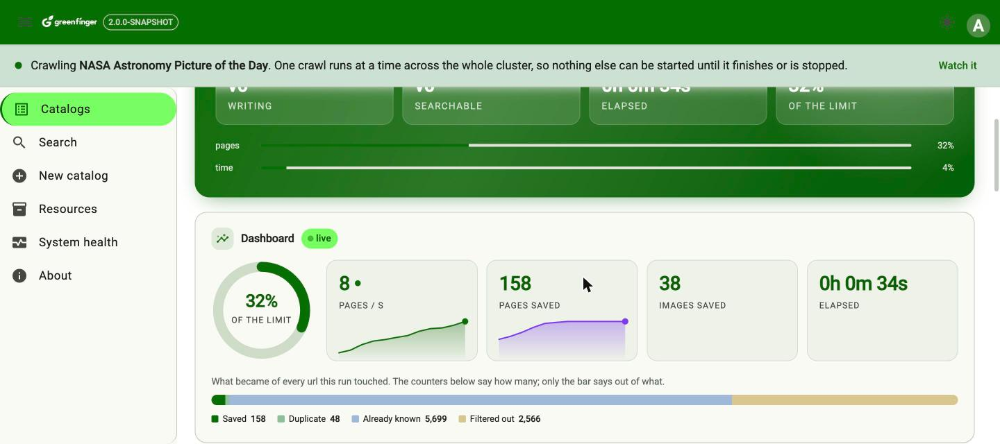
</p>

<p align="center">
  <em>A crawl of <a href="https://apod.nasa.gov/apod/">NASA's Astronomy Picture of the Day</a>, three nodes sharing the work.
  Every screenshot in this README is from that run &mdash; see <a href="#the-pages">the pages</a>.</em>
</p>


## 🌟 What it does
------------------------------

1. **Three outputs, and they stack.**
   Files on disk (or MinIO), an Elasticsearch index, and a vector collection. Pick any combination;
   the file layer is always on, because the database keeps metadata only and the other two are
   rebuilt from what it wrote. A finished crawl can be **replayed into the index or the vectors
   without fetching the site again** -- and files that were lost can be **fetched back from the
   urls the rows record**, one page at a time and only the ones that are actually missing.

2. **Pages and images.**
   Images come from ``, from `srcset`/`<picture>` and from `og:image`, filtered by size, media
   type and byte count so icons and tracking pixels do not fill the disk. Identical bytes are stored
   once however many pages point at them, and the wording around each picture is kept so an image
   with no alt text can still be found by searching for words.

3. **The article, not the furniture.**
   Navigation, sidebars and footers are dropped before anything is indexed, using the link-density
   method boilerplate detection has used since Boilerpipe. No model and no dictionary, so it works
   the same in any language.

4. **Deduplication in two passes.**
   Urls are normalised — RFC 3986 folding, then tracking parameters dropped and query parameters
   sorted — and kept in RocksDB. Content is fingerprinted too, either exactly (SHA-256) or
   approximately (SimHash with banded lookup), so the same article under two urls is stored once.

5. **Never leaves the site.**
   Two boundary rules run before anything else and cannot be switched off: the registrable domain
   must match, and every url must sit under `start_url`. One stray advert link is all an unbounded
   crawler needs to wander off into the rest of the web.

6. **Javascript only when it is needed.**
   The default extractor fetches over plain http and starts a browser only for the pages that came
   back as an unrendered shell — no browser at all on a site that does not need one. HtmlUnit is
   the fallback because it needs nothing installed; Playwright and Selenium render better and both
   want a browser on the machine first.

7. **Versions, and a merge.**
   `rebuild` opens a new version beside the old one, which keeps serving search until the new one
   finishes. `update --refresh` revisits what it already has and **merges what changed**, writing
   nothing at all for the pages that came back the same.

8. **Resumable.**
   The frontier is on disk, so a crawl killed halfway carries on from where it stopped rather than
   from the beginning.

9. **Search that prefers the real page.**
   A listing matches the same words as the article it links to and is almost never the answer, so
   both the index and the vector store rank detail pages above listings. Deep paging goes past
   Elasticsearch's 10,000 result ceiling with a cursor.

10. **Embeddings with no account.**
    The default provider runs `multilingual-e5-small` and `SigLIP 2` locally — text search, image
    search, and **finding pictures by describing them**. Ollama and OpenAI are configuration, not
    code.


## 🚀 Technology Stack
-----------------------------------------

| Technology | Version | Used for |
|---|---|---|
| ☕ **JDK** | 17 or later | Runtime |
| 🌱 **Spring Boot** | 4.1.x | Application framework and auto-configuration |
| 🐚 **Spring Shell** | 4.0.x | The interactive command line |
| 🗄 **RocksDB** | 10.x | Resumable frontier and both deduplication stores |
| 🌐 **Apache HttpClient** | 5.x | The default fetch engine, behind Spring's `RestClient` |
| 📄 **HtmlUnit** | 4.x | Lightweight scripted-page rendering |
| 🎭 **Playwright** | 1.6x | Full browser rendering |
| 🕷 **Selenium** | 4.x | WebDriver rendering |
| 🍜 **Jsoup** | 1.23 | Parsing, link and image extraction |
| 🔎 **Lucene** | 9.12 | The embedded index and vector store: the default, and nothing to install |
| 🔍 **Elasticsearch** | 7, 8 or 9 | The search output path, when one machine is not enough |
| 🧭 **Qdrant / Weaviate** | current | The vector output path, likewise |
| 🪣 **MinIO** | 9.x | Image storage, when not on local disk |
| 🐘 **PostgreSQL / MySQL / H2 / SQLite** | current | The metadata store. H2 by default: nothing to install |
| 🔐 **Spring Security** | 7.x | The server's login, and the two roles |
| 🅰️ **Angular** | 21 | The web interface, signals throughout |
| 🎨 **Angular Material + Tailwind** | 21 / 4 | Components, and everything around them |


## Install
-----------------------------

* Git repository: https://github.com/paganini2008/greenfinger.git
* Directory structure:

``` shell
📂 greenfinger
├── 📂 backend                              # the crawler
│   ├── 📂 greenfinger-core                 # engine, the six pluggable components, the outputs,
│   │                                       #   the vector stores, embeddings, persistence and
│   │                                       #   the services both front ends drive
│   ├── 📂 greenfinger-cluster              # the crawl across processes: one url dispatched is
│   │                                       #   one recursive call, plus the replication that
│   │                                       #   keeps every node's copy complete
│   ├── 📂 greenfinger-api                  # the server: REST api, login, and the page it serves
│   └── 📂 greenfinger-shell                # the command line application
├── 📂 deploy                               # what you run -- made by the build, not in git
│   ├── 📜 greenfinger-cli.sh               # one command, run once
│   ├── 📜 greenfinger-face.sh              # the greenfinger:> prompt
│   ├── 📜 run-local.sh                     # the server: api and front end, n nodes
│   ├── 📜 run-docker.sh                    # the same, in containers
│   ├── 📜 run.conf                         # what every launcher reads
│   ├── 📜 .env                             # secrets, and only secrets
│   ├── 📂 config                           # application.yml, -dev and -prod
│   ├── 📂 lib                              # the two executable jars
│   ├── 📂 docker                           # the image definitions and the built front end
│   └── 📂 data, logs                       # what a run leaves behind
├── 📂 frontend                             # web interface
│   └── 📂 greenfinger-ui                   # Angular 21, signals, Material, Tailwind
├── 📂 docs                                 # README and the 2.0 design document
├── 📂 history                              # the 1.x implementation, for reference
├── 📜 LICENSE
└── 📜 README.md
```

### Build

``` shell
cd backend
mvn clean install
```

That produces `deploy/` -- the four launchers, the jars in `lib/`, the configuration in `config/`
and `run.conf` beside them.

**`deploy/` is not in the repository.** Everything in it is put there by the build, so there is one
copy of every file and it is the one you edit:

| In deploy/ | Edited in |
|---|---|
| `greenfinger-cli.sh`, `greenfinger-face.sh`, `run.conf`, `.env.example` | `backend/greenfinger-shell/src/main/resources/bin/` |
| `run-local.sh`, `run-docker.sh` | `backend/greenfinger-api/src/main/resources/bin/` |
| `config/` | `backend/greenfinger-shell/src/main/resources/config/` |
| `docker/Dockerfile`, `dockerignore` | `backend/greenfinger-api/src/main/resources/docker/` |
| `docker/Dockerfile.web`, `docker/server.js`, `docker/static/` | `frontend/greenfinger-ui/` (`npm run build:deploy`) |

Deleting `deploy/` and rebuilding is therefore safe, with three exceptions a build cannot put back:
`data/` (everything crawled), `.env` (secrets, which exist nowhere else), and a `run.conf` you have
filled in -- packaging writes that one only when it is missing, so it survives a rebuild but not a
delete. `.env` is never copied at all; `.env.example` is what ships.


## Quick start
-----------------------------

Two steps: describe what to crawl, then run it. The first is a set of questions, and only the url
has no default -- everything else has a value chosen to give a useful crawl on a site you know
nothing about, so it is mostly return.

``` shell
cd deploy
./greenfinger-face.sh

greenfinger:> catalog-save
New catalog
Return keeps what is in the brackets. 'cancel' abandons the whole thing.
  url            (http:// or https://) []: https://example.com
  name           (unique; defaults to the domain) [example]:
  ...
Saved 'example'
Id: 01a064a8-af7f-7000-b7b3-7628bd8a1fc3
  start now      (no | crawl | update | rebuild) [no]: crawl
```

That crawls up to 10,000 pages with no depth limit, a second apart, downloads the images, records
the metadata in an H2 file and writes the pages under `./data`. Nothing has to be installed and no
account has to be opened.

The id it printed is what every other command takes -- never the name, which is editable and would
make a script correct only until somebody renamed a catalog. `catalog-list` prints the ids.

``` shell
./greenfinger-cli.sh catalog-list                            # the ids
./greenfinger-cli.sh catalog-crawl --id=<id>                 # crawl from the start url
./greenfinger-cli.sh catalog-crawl --id=<id> --node=3        # three processes on this machine
./greenfinger-cli.sh update --id=<id>                        # take urls that appeared since
./greenfinger-cli.sh update --id=<id> --refresh=true         # and merge what changed
./greenfinger-cli.sh rebuild --id=<id>                       # a new version, old one still served
./greenfinger-cli.sh versions --id=<id>                      # what versions there are
./greenfinger-cli.sh crawler-report --id=<id>                # what the last one cost
./greenfinger-cli.sh search --query "some words"             # full text
./greenfinger-cli.sh search --query "a cat on a wall" --image=true   # pictures, by describing them
./greenfinger-cli.sh delete --id=<id> --keep-latest=3
./greenfinger-face.sh                                        # a session, with a prompt
./greenfinger-cli.sh help                                    # every command
```

Every option is long form; there are no one-letter forms. At the prompt a crawl runs behind it: `q`
then return leaves the live view without stopping the crawl, `status` brings it back, and `pause` is
what stops it.

**Settings are not options.** Which cluster this node joins, where it writes, how many nodes to
start: `deploy/run.conf`, read by every launcher here -- the prompt, the one-shot command line, the
server, and both `run-*.sh` scripts. They describe the installation rather than the command, so the
prompt and the server started side by side are one installation and see each other's catalogs.
Secrets and the addresses of databases and stores stay in `deploy/.env`.

### Four sites to start with

An empty page is a bad first impression, and picking a site to crawl is a decision nobody should
have to make in the first five minutes. `deploy/examples/catalogs.json` holds four that are worth
crawling: each publishes a permissive robots.txt, each finishes in a minute or two, and each shows
a different part of the crawler doing something.

``` shell
cd deploy
./examples/seed-catalogs.sh              # localhost:50080, admin/admin123
./examples/seed-catalogs.sh http://host:50080
```

It creates the definitions and stops; press **Crawl** in the front end, or
`./greenfinger-cli.sh catalog-crawl --id=<id>`, when you want one to run.

| Catalog | Why it is here |
| --- | --- |
| [APOD](https://apod.nasa.gov/apod/) | Plain static html and one large public-domain photograph per page: the example that shows the image pipeline doing something. |
| [Hackaday](https://hackaday.com/) | A busy WordPress site — article text wrapped in a lot of furniture, a dozen images a page. Good for watching the readability extraction and the image filters work. |
| [Rust Blog](https://blog.rust-lang.org/) | Small, static, entirely article text. The fastest to finish and the one to point an index or a vector store at first. |
| [Wikinews](https://en.wikinews.org/wiki/) | Note the url ends at `/wiki/` and not at `/wiki/Main_Page`. **The url is the boundary as well as the seed**, so a deep entry point puts the rest of the site out of scope and the crawl saves exactly one page. |

### What lands on disk

```
deploy/data/                                 the default GF_DATA_STORE
  system/                                    the crawler's working state; local, always
    greenfinger.mv.db                        H2, when no database server was configured
    frontier/                                RocksDB: the urls still to visit
    dedup/url/  dedup/content/               RocksDB: what has been seen already
  user/                                      what was crawled; this is what a search reads
    assets/
      {catalogId}/
        v0/
          settings.json                      how this version was configured, and how it went
          reports/{stamp}-{action}-{node}.json   one file per run
          pages/ab/cd/{id}.html              the page as fetched
          pages/ab/cd/{id}.txt               the article, with the navigation removed
          images/ab/cd/{id}.jpg              the pictures it referenced
        v1/ ...                              a rebuild leaves the previous version alone
    index/{prefix}-{catalogId}/              embedded Lucene, one index per catalog
    vector/{collection}_{dimensions}/        embedded Lucene, one collection per embedding width
```

Two halves on purpose. **`system/` can be deleted without affecting a search** -- it costs a resume
and nothing else. `user/` is the half worth backing up.

Assets and index are addressed by the catalog's **id**, never its name, so renaming a catalog moves
nothing on disk. Vectors are not split per catalog: which catalog and which version a vector
belongs to is a field on the point, filtered at query time -- the same way Qdrant and Weaviate are
addressed.

The version is part of the path, so removing one version is removing one directory. Pointing the
crawler at MinIO instead produces object keys identical to these paths, and `index/` and `vector/`
simply do not exist when Elasticsearch, Qdrant or Weaviate is configured.

## The four launchers
-----------------------------

`deploy/` holds four executables and nothing else you have to run. They are four faces on the same
jar, not four programs: the same crawler, the same configuration, the same data store.

| | What it is |
|---|---|
| `./greenfinger-cli.sh <command>` | One command, printed, done |
| `./greenfinger-face.sh` | A prompt: type commands, watch a crawl live |
| `./run-local.sh` | The nodes here as background processes; `all` adds the front end |
| `./run-docker.sh` | The same, one container per node, plus the front end container |

``` shell
cd deploy
./greenfinger-face.sh                  # define a catalog, crawl it, watch it
./run-local.sh                         # the nodes, http://localhost:50080
./run-local.sh all                     # and the front end, http://localhost:9700
GF_NODES=3 ./run-local.sh all          # three nodes sharing the crawl, one page in front
./run-docker.sh                        # the same in containers, front end on 9700
./run-local.sh stop                    # or ./run-docker.sh down
```

**Settings are not options.** Which cluster this node joins, where it writes, how many nodes to
start: `deploy/run.conf`, read by all four. They describe the installation rather than the command,
so a prompt and a server started side by side are one installation and see each other's catalogs.
Addresses and passwords stay in `deploy/.env`.

Every action, option and verb: **[docs/cli-reference.md](docs/cli-reference.md)**.


## Running a cluster
-----------------------------

A crawl always runs on a cluster, and one process is a cluster of one. There is no separate
standalone mode to grow out of: the same command starts a node, and a second node with the same
configuration joins it and starts taking urls.

``` shell
cd deploy
./run-local.sh                 # one node,  http://localhost:50080
./run-local.sh                 # what run.conf describes; GF_NODES=3 for three
./run-local.sh status          # what is running
./run-local.sh status          # what is running
./run-local.sh stop            # stop them all
```

Several machines is the same command on each, with the same configuration:

``` shell
# machine A
./run-local.sh
# machine B
GF_CLUSTER_HOSTS=10.0.1.10,10.0.1.11 ./run-local.sh
```

Containers are the same shape again:

``` shell
./run-docker.sh                # what run.conf describes, in containers
./run-docker.sh logs 2         # follow node 2
./run-docker.sh stop
```

> **A cluster is everybody sharing a name and a port, and both halves matter.**
>
> The **name** decides who joins whom: two deployments sharing it become one cluster and find that
> out by replicating each other's writes, deletes included.
>
> The **port** is the election -- whoever holds it leads -- and holding a port is machine-wide
> rather than per cluster. A second cluster with its own name but the same port therefore never
> elects anybody: the port is taken, by a node it does not consider a member. Everything then
> works except the things that need a leader, and the counters simply stop moving.
>
> So set both (`GF_CLUSTER_NAME`, `GF_CLUSTER_PORT`) on any machine that runs more than one.
> `run-local.sh` (`greenfinger-local`, 22010) and `run-docker.sh` (`greenfinger-docker`, 22020)
> already differ from the plain launcher (`greenfinger-cluster`, 22000) for exactly this reason.

### How the work is shared

A crawl is a recursive function -- handle a page, then handle every link on it -- and the only
thing the cluster changes is where the recursive call lands. Every url found on a page is sent to
one node, round robin, the sender included; that node fetches it and sends its links onward. There
is no queue in the middle and no node that only coordinates: the leader crawls like everybody
else.

The node the command arrived at seeds the entry point and tells the others, and that is the whole
of its privilege. The leader's only job is publishing the finished version to search -- and even
that is not a correctness mechanism, since publishing twice writes the same row twice. Asking one
node is about not doing the same work three times.

**Nobody decides the crawl is over.** Whether it has reached `maxFetchSize` or run out of
`fetchDuration` is a question about counters every node shares, so every node asks it of the same
numbers and reaches the same answer; the first to notice writes the flag and the reason beside
those counters, and the others read it on their next tick. That is how 1.x worked -- with Redis
where this has the cluster cache -- and a leader that judged completion would be a single point of
failure for a decision that does not need one.

**Quiet counters mean one of two things, and the difference decides whether anything is
published.** Every url is counted when it is dispatched and counted again when somebody has
finished with it. If the crawl goes quiet with the two equal, nothing is queued or in flight
anywhere: the site ran out of urls, and the version is published without waiting for
`fetchDuration`. If it goes quiet with them apart, a node stopped answering while holding urls --
those pages will never arrive, so the run ends without publishing and the frontier keeps what was
missed for a resume.

### Every node keeps a full copy

Each node has its own database file, its own pages and its own dedup stores, and replication keeps
the copies the same. That is why several nodes on one machine each get their own data directory --
`run-local.sh` refuses to start if they would share one -- and it is why running three nodes on
one machine and three across three machines are the same thing, with no special case between them.

What gets copied depends on where the data actually lives, which is read off the configuration
rather than assumed:

| Store | Per node | Copied |
|---|---|---|
| SQLite, H2 in file or memory mode | yes | rows, as they are written |
| MySQL, PostgreSQL, SQL Server, Oracle, H2 over tcp | no | nothing: one server, every node dials it |
| Pages and images on local disk | yes | the bytes, as they are written |
| Pages and images in MinIO | no | nothing |
| Elasticsearch, Qdrant, Weaviate | no | nothing: one server, every node queries it |
| The embedded Lucene index and vectors | yes | the documents and the vectors, as they are written |
| The frontier and the dedup filters (RocksDB) | yes | the dedup filters only -- a frontier is a node's own work queue |

Shared stores are less work for the cluster and less traffic on the network, so a real deployment
should prefer them: MinIO for the pages, and one of the four servers for the metadata. The startup
line says which of the two each node is using, because getting it wrong produces no error at all --
only a search that answers differently depending on which node was asked.

### Putting back what was lost

The index and the vectors are rebuilt from the database, which keeps everything they need:

``` shell
./greenfinger-cli.sh replay --id=<id> --layers=index+vector
```

Files are different. The database keeps a page's metadata and the path its bytes were written to,
never the bytes -- but it does keep the url the page came from and the source url of every image
on it, which is enough to go and get them again:

``` shell
./greenfinger-cli.sh replay --id=<id> --layers=file
```

This fetches, but it discovers nothing: no links are followed, no rows are written, and no page is
visited that is not already in the table. A page whose files are all present is skipped without a
request, so it is safe to run twice and cheap the second time. What comes back is the site **as it
is today** -- a page that has changed no longer matches the index built from the old text, and a
page taken down cannot be restored at all; both are counted and reported rather than passed over.
Ask for `file,index,vector` to repair a version completely, in that order.

In a cluster this one layer is not divided up. Every node keeps its own copy of the files, so what
is missing is a different set on each of them: the request goes to all of them and each repairs
itself, which means it does not matter which node you ask. A node with nothing missing sends no
requests at all.

### What each run leaves behind

Every crawl writes a report beside the version it produced, one per node:

```
deploy/data/user/assets/01a064a8-af7f-7000-b7b3-7628bd8a1fc3/v0/reports/20260902-140237-crawl-b975f6ac.json
```

It carries the whole picture, not that node's share: what was produced, how it ended, and -- the
part that cannot be reconstructed afterwards -- what each node contributed. Urls dispatched
against urls handled is in there too, so a run that stopped at a limit says how much it left
behind and what to do about it:

``` json
"urls":   { "dispatched": 586, "handled": 46, "outstanding": 540 },
"byNode": { "savedResourceCount": { "f390e46f": 16, "58cf036a": 14, "c5df1331": 12 } },
"ending": { "reason": "reached maxFetchSize: savedResourceCount = 41 > 40",
            "note": "540 url(s) were dispatched and never reported finished. They are still on a
                     frontier; run 'update --id=<id>' to pick them up." }
```

The command line prints the path when a crawl finishes. The web interface charts them on the
Monitor page, and the Cluster page shows what this node can see of the cluster itself -- members,
who leads, and what each channel has carried.


## Commands
-----------------------------

| Command | What it does |
|---|---|
| `catalog-save` | Create a catalog, one question at a time |
| `catalog-save --id=<id>` | Change one that exists, the current values in the brackets |
| `catalog-list` | Every catalog, with the ids everything else takes |
| `catalog-show --id=<id>` | One catalog's whole definition |
| `catalog-delete --id=<id>` | Remove the definition, stopping its crawl first |
| `catalog-cats` | Every category in use |
| `versions --id=<id>` | Every version, what it holds, which one search serves |
| `crawler-report --id=<id>` | The stored report of a version: the dashboard, frozen |
| `catalog-crawl --id=<id>` | Crawl from the start url |
| `catalog-crawl --id=<id> --node=<n>` | The same, on n processes on this machine |
| `update --id=<id>` | Continue, taking urls that have appeared since |
| `update --id=<id> --refresh=true` | Also revisit known pages and merge what changed, asking each with `If-None-Match` first |
| `resume --id=<id>` | The same thing, after a pause |
| `rebuild --id=<id>` | A new version; the old one keeps serving search until this finishes |
| `pause --id=<id>` | Ask a running crawl to stop, letting in-flight pages finish |
| `status` | Watch what is running, redrawn in place; `q` stops watching |
| `status --all=true` | The same, with a row per node |
| `delete --id=<id> --version=<n>` | Remove one version, from any combination of stores |
| `delete --id=<id> --all=true` | Every version; the index stays, empty |
| `delete --id=<id> --purge=true` | Every version, and the index is dropped too |
| `replay --id=<id> --layers=index` | Rebuild an output from the database, without crawling |
| `replay --id=<id> --layers=file` | Fetch back files that were lost, from the urls the rows record |
| `test-url --url=<url>` | Fetch one url and report what came back |
| `search --query=<words>` | Full text |
| `search --query=<words> --image=true` | Find pictures by describing them |
| `index-info` | The full text index: where it is, and what is in it |
| `vector-info` | The vector store: where it is, and what is in it |
| `options` | Every catalog setting, what it accepts and its default |

### Choosing where the results go

The outputs stack, and `file` is always among them:

`output-types` is one of the questions `catalog-save` asks, joined with `+`:

```
  output-types   (file+index+vector, joined with + (file is always on)) [file]: file+index
  content        (text+image | text) [text+image]: text
```

`file` is added whether or not it is typed. `content` is a different question from `images`:
`images` decides whether pictures are fetched at all, `content` whether they reach the index and the
vector store.

``` shell
GF_FILE_TARGET=minio ./greenfinger-cli.sh catalog-crawl --id=<id>   # files into MinIO
```

Or crawl to files first, look at what came back, and only then commit to an index — the database
already holds everything needed to build one:

``` shell
./greenfinger-cli.sh catalog-crawl --id=<id>
./greenfinger-cli.sh replay        --id=<id> --layers=index+vector
```

### Removing what a crawl produced

``` shell
./greenfinger-cli.sh delete --id=<id> --version=3 --dry-run=true     # report only
./greenfinger-cli.sh delete --id=<id> --version=3                   # all four stores
./greenfinger-cli.sh delete --id=<id> --version=3 --layers=vector
./greenfinger-cli.sh delete --id=<id> --keep-latest=3               # keep the newest three
./greenfinger-cli.sh delete --id=<id> --all=true                    # empty it; the index stays
./greenfinger-cli.sh delete --id=<id> --purge=true                  # and drop the index too
```

Deleting runs in the reverse of the order writing runs in, because the database is the list of what
there is to delete. It reports per store, and is safe to run again after a partial failure.


## Configuration
-----------------------------

Everything tunable lives in one place, `deploy/config`, beside the jar rather than inside it, and
both faces read the same files — a setting means the same thing whether the command line or the
server is running. Every value in them reads an environment variable with a sensible fallback, and
the launchers source `.env` before starting, so **the file you change is `deploy/.env`** and
nothing has to be rebuilt or edited inside a jar. `deploy/.env.example` lists everything.

| File | What is in it |
| --- | --- |
| `application.yml` | Everything common: the crawler, the outputs, the embeddings, the server's port and its accounts |
| `application-dev.yml` | Zero configuration, and the default: an H2 file, pages on local disk, nothing to install |
| `application-prod.yml` | A real deployment: your own database, and all three outputs on |

Switch between the last two with `GF_PROFILE=dev` or `GF_PROFILE=prod`.

``` shell
# deploy/.env
GF_OUTPUT_TYPES=file,index,vector
GF_ES_URIS=http://localhost:9200
GF_QDRANT_URL=http://localhost:6333
GF_EMBEDDING_PROVIDER=local        # local | ollama | openai
GF_EXTRACTOR=adaptive              # http first, a browser only when a page needs one
GF_MAX_FETCH_SIZE=10000

# a production metadata store instead of the H2 file
GF_DB_URL=jdbc:postgresql://localhost:5432/demo?currentSchema=greenfinger
GF_DB_USERNAME=...
GF_DB_PASSWORD=...
GF_DB_DRIVER=org.postgresql.Driver

# the only genuinely secret value, and only for the openai provider
OPENAI_API_KEY=sk-...
```

The metadata store is not optional, but it costs nothing to have: the default is an H2 file beside
the output. H2, SQLite, PostgreSQL, MySQL, SQL Server and Oracle are all supported.

``` shell
# any of these instead of the default H2 file
GF_DB_URL=jdbc:postgresql://localhost:5432/demo?currentSchema=greenfinger
GF_DB_URL=jdbc:mysql://localhost:3306/demo
GF_DB_URL=jdbc:sqlserver://localhost:1433;databaseName=demo;encrypt=false;trustServerCertificate=true
GF_DB_URL=jdbc:oracle:thin:@//localhost:1521/demo
GF_DB_URL=jdbc:sqlite:./data/system/greenfinger.db
```

Which one you pick also decides how much a cluster has to copy. The four servers are shared: every
node dials the same database and nothing is replicated. H2 in file or memory mode and SQLite give
each node its own file, so every row is sent to the others as it is written. Neither is wrong, and
the startup line says which one is in use.

For anything you cannot afford to lose, create the schema from a script rather than letting
Hibernate do it. `docs/sql/` has one per database, generated from the entities:

``` shell
psql -h localhost -U greenfinger -d greenfinger -f docs/sql/schema-postgresql.sql
# then, in .env
GF_DB_DDL=validate
```

The default, `update`, only ever adds — a column whose type changed is left alone, a dropped one
stays, and two nodes starting together race to create the same table. `validate` makes a node
refuse to start when the schema and the entities disagree, which is where you want to find that
out. See `docs/sql/schema-scripts.md`.

SQLite takes one writer at a time, so it wants a narrower crawl than the others — set
`GF_WORK_THREADS=4`. Write ahead logging and a busy timeout are added to its url automatically, and
it is the one database that needs its dialect named (`GF_DB_DIALECT`), because Hibernate ships no
SQLite dialect of its own. A write it refuses because another worker holds the lock is offered
again rather than dropped, so a wide crawl on SQLite is slower than on a server but does not lose
pages.

### Embeddings

The default provider runs the models locally, so a new user opens no account and buys no quota.
That is not the same as downloading nothing — weights cannot go in a jar — but **nothing is fetched
until a crawl actually asks for vector output**, which the default configuration does not.

| Provider | Text | Images |
|---|---|---|
| `local` (default) | `multilingual-e5-small`, 384 dimensions | `SigLIP 2`, 768 dimensions |
| `ollama` | any model on a local Ollama | — |
| `openai` | `text-embedding-3-small` | — |

Only the local provider embeds images, because Ollama's embedding endpoint and OpenAI's both take
text alone. Anyone plugging in their own model implements one method; the image ones are optional.

Both default models are permissively licensed — e5 under MIT, SigLIP 2 under Apache-2.0 — so
whether this can be used commercially is decided by which provider is configured, not by the
crawler.

**Fetching the weights.** The download happens by itself the first time a crawl asks for vector
output, into `GF_MODEL_DIR` (`~/.greenfinger/models` by default): 129 MB for the text tower, 522 MB
for both. It happens once, and only if a crawl actually asks for vector output.

For a machine with no route out: let one that has a connection do the download, copy that directory
across, and run with `--offline`. A missing file then fails immediately and says which one, instead
of hanging on a connection that will never open.

**What picture search is good at.** Describing what is *in* a picture works — a colour, a subject,
a composition. Searching for text that appears *on* a picture does not: the crawl stores thumbnails
at whatever size the site published them, and at 224×224 the model has nothing legible to read. On
a set of book covers, colour and "a black and white photograph" both land 4–5 results out of 5;
searching by the book's title, printed on its own cover, lands 4%.


## Embedding in an application
-----------------------------

**Step 1** — add the dependency:

``` xml
<dependency>
  <groupId>com.github.paganini2008</groupId>
  <artifactId>greenfinger-api</artifactId>
  <version>2.0.0-SNAPSHOT</version>
</dependency>
```

**Step 2** — turn it on. Deliberately explicit: having the jar on the classpath should not by
itself open RocksDB stores and hold a crawl semaphore.

``` java
@EnableGreenfingerServer         // the crawler, plus the REST api
@SpringBootApplication
public class Application { }
```

An application that drives the crawler from its own code and exposes nothing needs only
`greenfinger-core`, and says so:

``` java
@EnableGreenfingerCrawler        // the crawler alone, no http
@SpringBootApplication
public class Application { }
```

The command line is the same arrangement: it depends on core and uses `@EnableGreenfingerCrawler`.
The two front ends sit side by side over core rather than one on top of the other.

**Step 3** — inject what you need. `CrawlerLauncher`, `CatalogAdminService`, `CatalogDetailsService`,
`DeletionService`, `ReplayService` and `CrawlRegistry` are all available:

``` java
@RestController
@RequiredArgsConstructor
public class CrawlController {

    private final CatalogAdminService catalogAdminService;
    private final CrawlerLauncher crawlerLauncher;

    @PostMapping("/crawl")
    public String crawl(@RequestParam String url) throws Exception {
        Catalog catalog = new Catalog();
        catalog.setUrl(url);
        catalog = catalogAdminService.save(catalog);          // defaults filled in and stored
        crawlerLauncher.crawl(catalog.getId(), null);
        return catalog.getId();
    }
}
```

A crawl always runs from a definition that is in the database, never from request parameters — which
is what lets the command line and a web front end take the identical path.

Every bean is `@ConditionalOnMissingBean`, so replacing one — your own extractor, your own
deduplication filter, your own embedding model — leaves the rest in place.

To act on a crawl finishing rather than poll for it, listen for the event. It is published on
every node, exactly once each, after the version has been published and the stores closed:

``` java
@EventListener
public void onFinished(WebCrawlerCompletionEvent event) {
    if (!event.isInterrupted()) {
        notify(event.getCatalogId() + " v" + event.getVersion() + ": " + event.getReason());
    }
}
```

Nothing waits for a listener and a listener that throws is logged and stepped over — the crawl it
is about is already over. The state is still the shared counters' to answer for (`/summary` reads
them); this only says when to go and look.

### The REST api

When the starter is on a web application, it also contributes endpoints:

| Method | Path | What it does |
|---|---|---|
| `GET` | `/v2/catalog` | Every stored catalog |
| `GET` | `/v2/catalog/{name}/details` | The runtime view, defaults filled in |
| `POST` | `/v2/catalog` | Create or update |
| `POST` | `/v2/crawl/{name}` | Start a crawl in the background |
| `POST` | `/v2/crawl/{name}/update` | Continue; `?refresh=true` to merge what changed |
| `POST` | `/v2/crawl/{name}/rebuild` | A new version |
| `POST` | `/v2/crawl/{name}/interrupt` | Ask it to stop |
| `GET` | `/v2/crawl/status` | Live counters |
| `DELETE` | `/v2/crawl/{name}/versions` | Remove versions; a dry run unless told otherwise |
| `POST` | `/v2/crawl/{name}/replay` | Rebuild an output from the database, or fetch lost files back (`?layers=file`) |
| `GET` | `/v2/search?q=...` | Search |


## Web interface
-------------------------

The same crawler behind an http api and a login, plus an Angular front end that talks to it. The
command line needs none of this and has no login: `greenfinger-shell` depends on `greenfinger-core`
alone, and the server is a separate face over the same services.

### Running it

``` shell
cd deploy
./run-local.sh                        # http://localhost:50080
```

The jar serves the api and the built page from one origin, so there is no second server to run and
no CORS to configure in production. Deep links work on reload: `/catalogs` and `/search` are routes
the browser owns, and anything that is not a file and not an api call is answered with the page.

`./run-local.sh all` additionally starts the front end on a port of its own, which is what to do
with more than one node: it serves the built page and spreads `/v2` and `/actuator` across the
cluster, so a browser talks to the cluster rather than to whichever node somebody typed.

**It only needs one address.** Every node publishes its http port as cluster metadata, so the front
end asks whoever answers who else is in the cluster and forwards to all of them, checking again
every ten seconds. A node started later joins the rotation on its own; a node that stops leaves it;
and the entry point it was given can itself go away, because by then it has two other nodes to ask.

``` shell
GF_UPSTREAMS=localhost:50080 ./run-local.sh all   # one seed is enough
GF_DISCOVER=0 ./run-local.sh all                  # take GF_UPSTREAMS as the whole list instead
```

Turn discovery off when the nodes are reachable at addresses they do not know they have — a port
mapping, a tunnel — and the address they advertise to each other is not one the front end can dial.

### Signing in

Two accounts, handed out up front in `.env`. There is no registration, no user table and no
password reset, because this is an operator's tool rather than a public site.

| Account | Role | May |
| --- | --- | --- |
| `admin` / `admin123` | `ADMIN` | create catalogs, and run crawl / update / rebuild / replay / delete |
| `tester` / `tester123` | `SUPPORT` | read everything, change nothing |

``` shell
# deploy/.env -- change these before the server is reachable by anybody else
GF_USERS=admin:admin123:ADMIN,tester:tester123:SUPPORT
GF_SERVER_PORT=8080
GF_TOKEN_VALIDITY=8h
GF_CORS_ORIGINS=http://localhost:4200   # only needed for the dev server below
```


Login returns a bearer token; every later call carries it in `Authorization`. Logging out revokes
it on the server, so the button means something rather than merely clearing the browser.

``` shell
TOKEN=$(curl -s localhost:8080/v2/login -H 'Content-Type: application/json' \
        -d '{"username":"admin","password":"admin123"}' | jq -r .data.token)
curl -s localhost:8080/v2/catalog -H "Authorization: Bearer $TOKEN"
```

Reading is open to either role; anything that changes something needs `ADMIN`. A `SUPPORT` account
is refused with a 403 and told why, and the pages do not offer it buttons it would only be refused
on. `GET /v2/version` is open without signing in, so the login page can say which server it is.

### The pages

| Page | What it is for |
| --- | --- |
| **Catalogs** | Every crawl task as a card: outputs, versions, and the live counters of anything running. Crawl, update, rebuild, replay, edit and delete from here. |
| **New / Edit catalog** | A url is the whole requirement; every limit and pattern below it has a working default, and the form leaves them blank rather than inventing values. |
| **Monitor** | One catalog watched: the counters of the run in flight, or of the last one, from the same fields either way. Also the only place versions are deleted, behind a dry run and a confirmation. |
| **Resources** | The rows themselves, in crawl order, for any version — including one that was never published. Where a page's file went, and every picture it carried. |
| **Search** | Words (Elasticsearch or Lucene, highlighted, cursor-paged past the ten thousandth result), Meaning (text vectors), and Pictures (describe one and get it). The two vector modes page by offset — a similarity ranking exists only for the query that produced it, so there is no cursor to carry. |
| **System health** | Two halves: the cluster (throughput, channels, buffers, replicated stores, the health checks) and the crawler (what is running, how fast, and what the stores are holding). |

Light or dark, or whatever the machine says — one button in the toolbar, remembered per browser.
Every colour comes from a Material system token, so the switch is a single attribute on the page
rather than a second palette.

#### Catalogs

One card per site. The chips say where its pages go, the numbers say which version is being written
and which one search is serving, and a card that is crawling right now shows its progress in place.
While a crawl is running the other cards' buttons are disabled and say why: one crawl runs at a
time across the whole cluster.

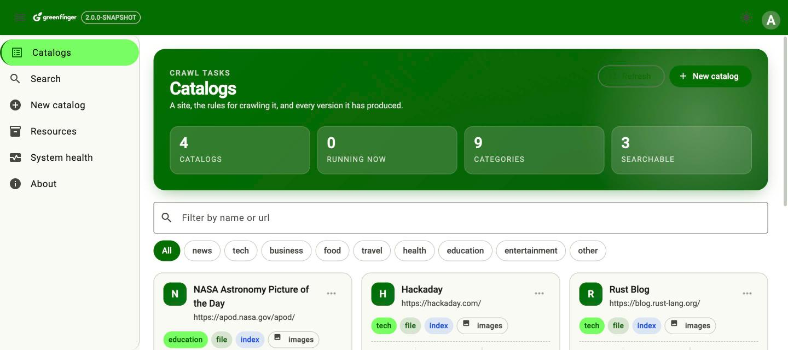

#### New catalog

A url is the only required field. Everything else — the limits, the patterns, the engine, how many
versions to keep — is left blank on purpose and takes the server's default, so a first crawl needs
one line and a careful crawl has somewhere to say so.

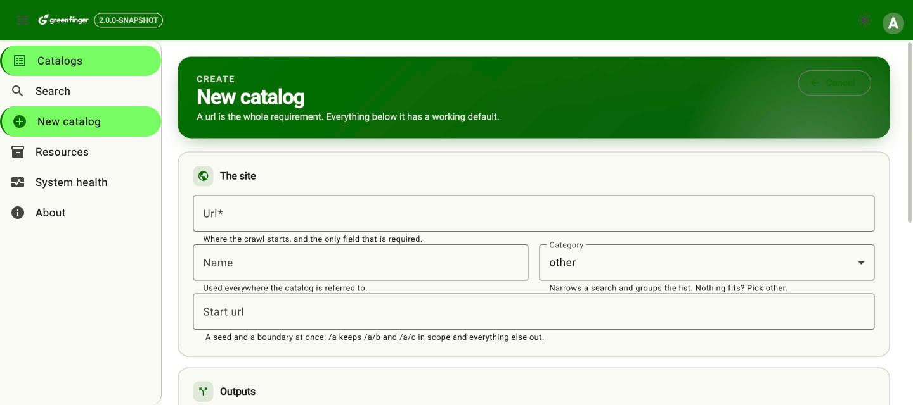

Files are always written, because the database keeps metadata only and the other two outputs are
rebuilt from what the files hold. Index and Vector stack on top of it, and either can be added later
to a crawl that has already run — a replay reads the pages back off disk rather than fetching the
site again.

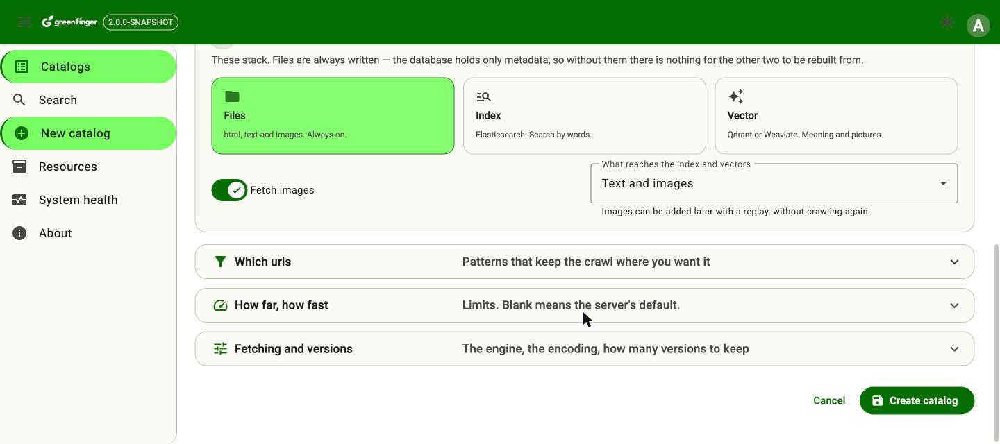

#### Monitor

The dashboard of one run: a ring for the limit it will stop on, pages a second as it is happening,
and one bar for what became of every url the run has touched. The counters underneath are the same
numbers the command line prints.

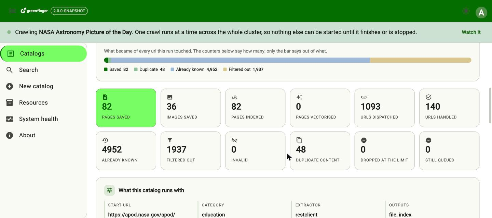

#### Resources

What actually got saved, filtered by version, by words in the url or title, and by when it was
crawled. Open a row and it says where the page was written, where its extracted text went, and what
the server said about it — and, for a page that carried pictures, every one of them with its own
source url and its own path in the store.

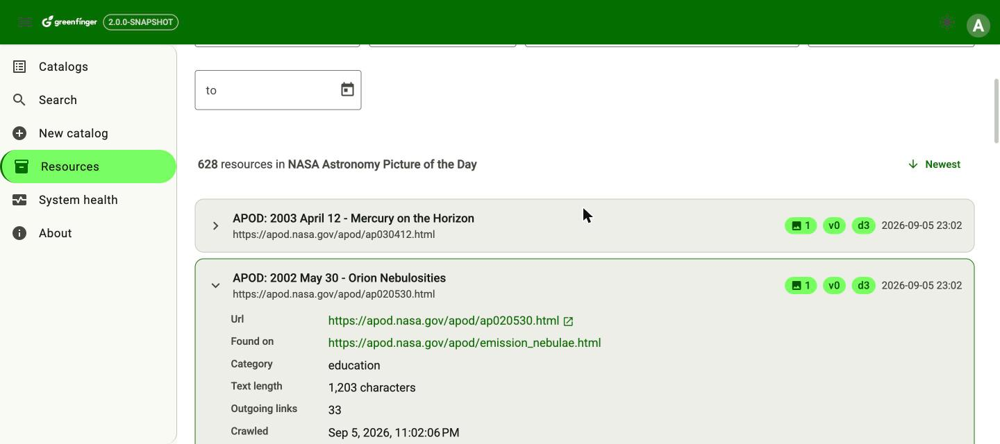

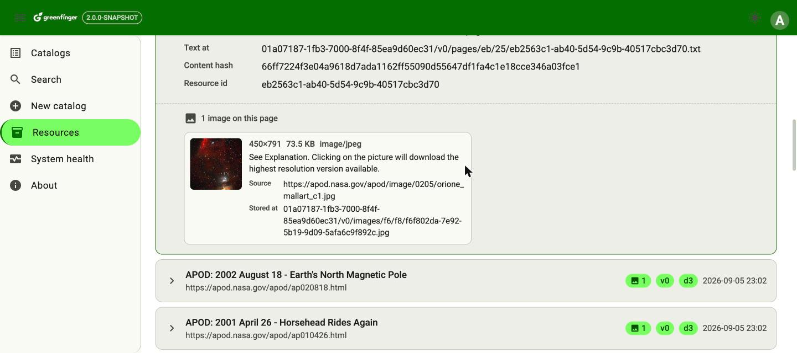

#### Search

Words are exact and highlighted; Meaning finds pages that never say them; Pictures takes a
description and returns photographs.

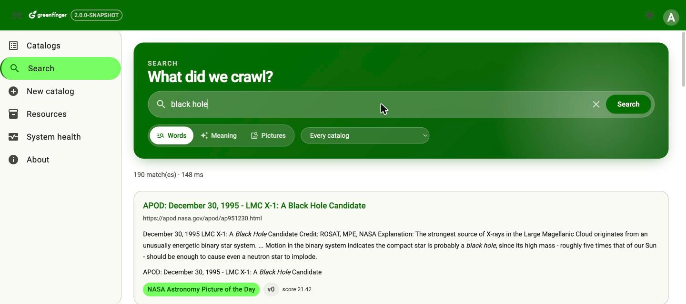

#### System health

The cluster half is this node's own account of itself — and only this node's, which is why the
node being asked is named at the top and can be switched. Ask a different one and everything on the
page is dropped and read again, because none of it was that node's.

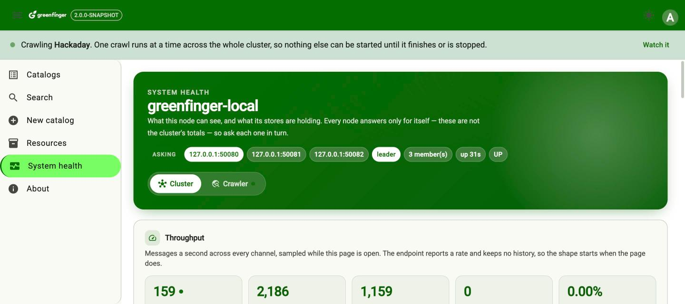

Throughput is sampled while the page is open, because the endpoint reports a rate and keeps no
history of its own — the shape starts when the page does, and is gone when it is closed.

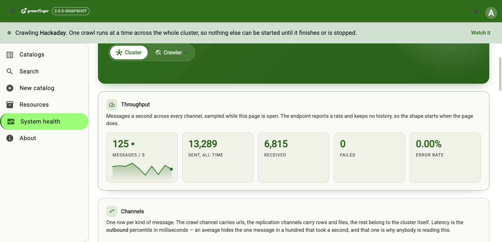

One row per kind of message, with the p50/p95/p99 of how long each took and the shape of the last
five minutes. A channel that has dropped anything is coloured, and a dropped message is work that
is gone: dropping is silent by design, so this is the only place it is ever said.

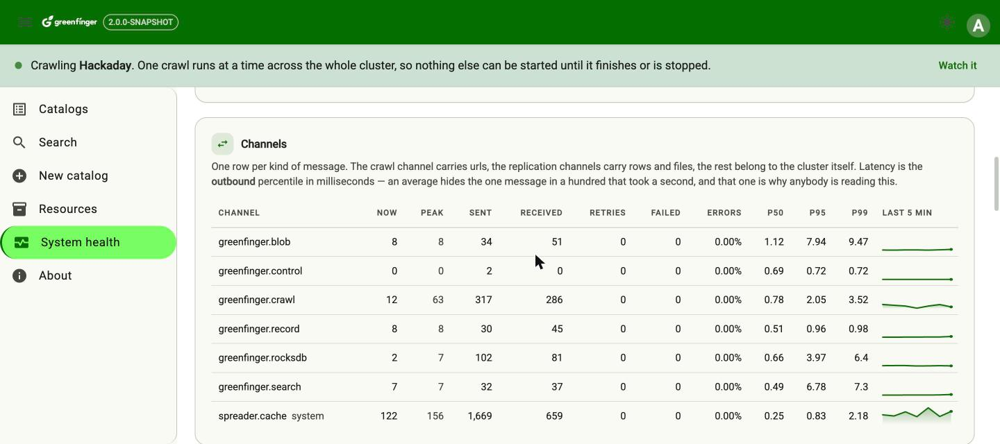

The crawler half is the work rather than the machinery: what is running, how fast pages and images
are arriving, and how much of the store each catalog has taken.

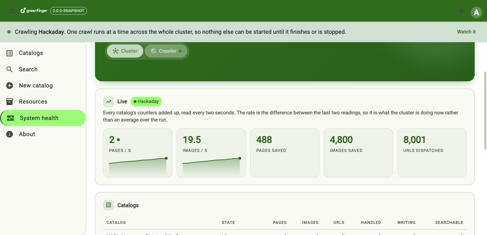

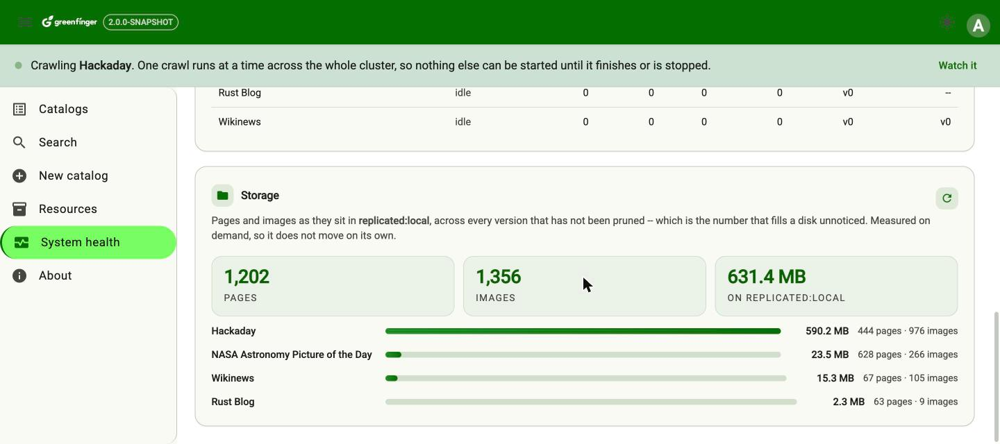

The same panel when the pages are going to an object store instead of local disk — the layout is
identical, so moving from one to the other is a setting rather than a migration.

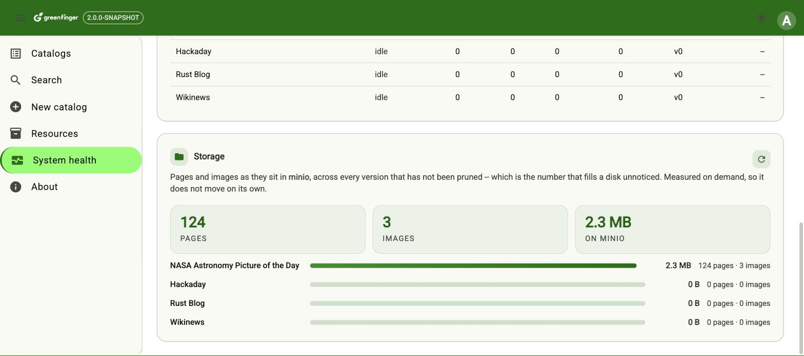

Nothing else about the page changes: the thumbnails below are the same pictures, fetched out of the
object store instead of off a disk.

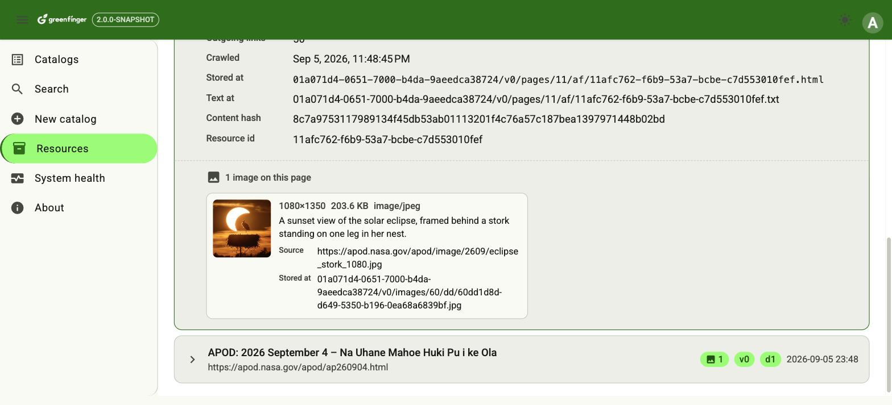

### Working on the front end

``` shell
cd frontend/greenfinger-ui
npm install
npm start                  # http://localhost:4200, proxying /v2 to :8080
                           #   GF_API_PORT=8088 npm start   if the server is elsewhere
npm test                   # vitest
npm run build:deploy       # build, and copy into deploy/docker/
npm run e2e                # playwright, against a server you started yourself
npm run icons              # regenerate the favicon from public/DefaultLogo.png
```

Angular 21 with signals throughout, RxJS for the http calls, Angular Material for the components
and Tailwind for layout. Green on white: one bold green surface per page, and everything under it
plain, so the colour carries the identity rather than merely decorating.


## Roadmap
-----------------------------

| Stage | Status |
|---|---|
| Standalone crawler, command line | ✅ Done |
| Three stacking outputs, images, resumable crawls | ✅ Done |
| Versions, merge, and a delete api | ✅ Done |
| Local embeddings, text and cross-modal image search | ✅ Done |
| REST api, login, two roles | ✅ Done |
| Web interface | ✅ Done |
| Distributed crawling | ✅ Done |


## Documentation

- **[Command line reference](docs/cli-reference.md)** -- the four launchers, and every command
  they accept with its options.
- **[Design notes](docs/design-2.0.md)** -- why the system is shaped the way it is.
- **[Schema scripts](docs/sql/schema-scripts.md)** -- one per database, for creating the schema
  yourself instead of letting Hibernate do it.
- **[Backend](backend/README.md)** and **[front end](frontend/README.md)** -- for working on them.

For setup instructions, API references and advanced configuration, see the
[Wiki](https://github.com/paganini2008/greenfinger/wiki/QuickStart).

---

## Contributing
Issues and pull requests are welcome. `mvn -o clean verify` in `backend/` is what a change has to
pass -- it runs the tests and fails the build below 80% line coverage, so a change that adds a
branch adds the test for it. [backend/README.md](backend/README.md) has the rest.

---

## License
Greenfinger is licensed under the Apache License. See [LICENSE](LICENSE) for details.

---
