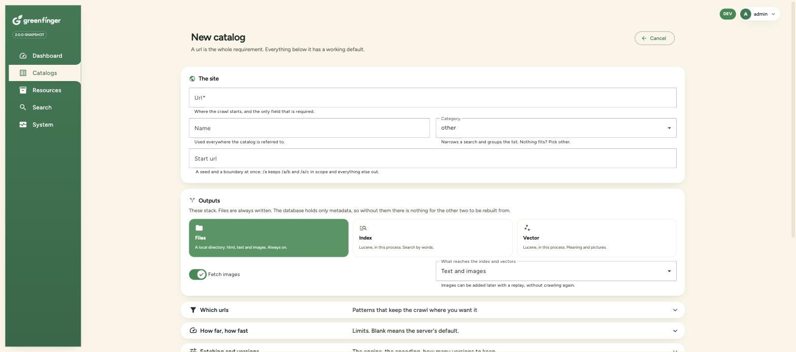
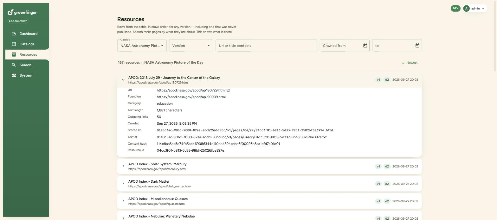
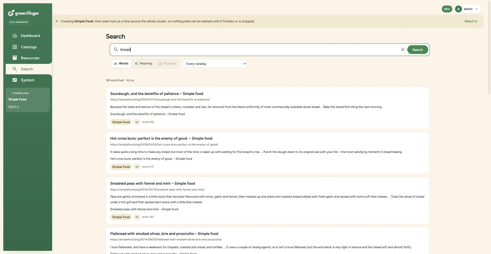
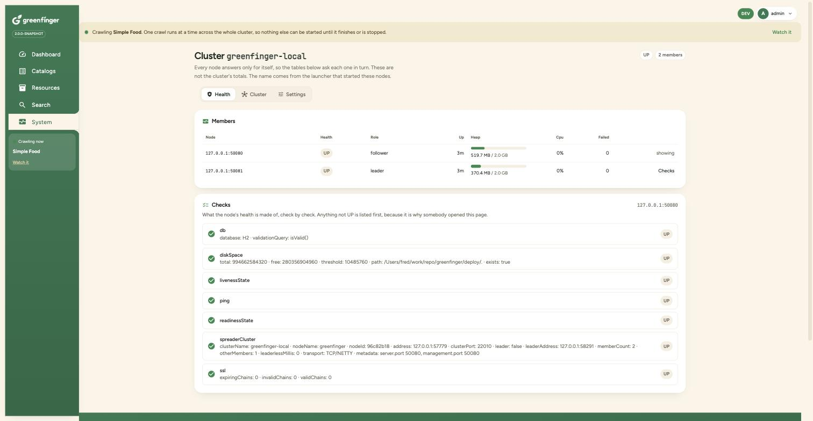

<h1 align="center">Greenfinger</h1>

<h2 align="center">One url in. A searchable archive out.</h2>

<p align="center">
<b>Crawl the whole site. Keep every page, every picture, every version.</b><br>
<b>Search it by words, by meaning, or by describing a picture you remember.</b><br>
<b>Add a node and it goes faster. Kill one and it keeps going.</b><br>
<b>Nothing to install. Nothing to sign up for.</b>
</p>

<p align="center">
<a href="LICENSE"></a>
<a href="https://spring.io/projects/spring-boot"></a>
<a href="https://openjdk.org/"></a>
<a href="https://www.elastic.co/"></a>
<a href="https://qdrant.tech/"></a>
<a href="https://min.io/"></a>
</p>

A distributed web crawler for the JVM. One pass writes plain files, a full text index and a vector
collection. Every node runs the same jar, there is no coordinator to deploy, and the first crawl
needs no database, no search server and no API key.


<p align="center"><em>A rebuild in progress. v1 keeps answering searches while v2 is being written, and each node reports what it pulled.</em></p>

## Table of contents

**Getting it running** [Quick start](#quick-start) · [Install](#install) · [Launchers](#launchers)

**What it does** [What it solves](#what-it-solves) · [One pass, three outputs](#one-pass-three-outputs) · [What one page goes through](#what-one-page-goes-through) · [Everything a catalog can set](#everything-a-catalog-can-set) · [Also in the box](#also-in-the-box)

**Using it** [Web interface](#web-interface) · [Command line](#command-line) · [Cluster](#cluster) · [What lands on disk](#what-lands-on-disk) · [Configuration](#configuration)

**Building on it** [Extending it](#extending-it) · [Embedding in an application](#embedding-in-an-application) · [REST api](#rest-api)

**Reference** [Stack](#stack) · [Documentation](#documentation) · [Roadmap](#roadmap) · [Contributing](#contributing) · [License](#license)

## Quick start

``` shell
cd deploy
./greenfinger-cli.sh --cluster=demo crawl --url=https://books.toscrape.com
```

Up to 10,000 pages, no depth limit, a second apart, images downloaded, metadata in an H2 file and
pages under `./data`. A dashboard is drawn while it runs and the catalog id is printed at the end.

``` shell
./run-local.sh                # nodes plus the page on http://localhost:9700
./run-docker.sh               # the same, in containers
./run-local.sh stop
```

Sign in with `admin` and the password in `deploy/config/api/users.xml`. Seven example catalogs ship
with a fresh install, so there is something to crawl before you have picked anything.

`--cluster=<name>` is required and has no default. A cluster crawls one catalog at a time, so the
name is what keeps two runs apart.

## Install

Requirements: JDK 17 or later, Maven 3.9 or later, Node 20 or later for the front end.

``` shell
git clone https://github.com/paganini2008/greenfinger.git
cd greenfinger/backend
mvn clean install
```

That produces `deploy/`: the four launchers, the jars in `lib/`, the configuration in `config/`,
and `run.conf` beside them.

``` text
greenfinger
├── backend
│   ├── greenfinger-core      engine, pluggable components, outputs, vector stores,
│   │                         embeddings, persistence, the services both front ends drive
│   ├── greenfinger-cluster   the crawl across processes, plus replication
│   ├── greenfinger-api       REST api, login, and the server that serves the page
│   └── greenfinger-shell     the prompt and the one line crawler
├── frontend/greenfinger-ui   Angular 21
├── deploy                    produced by the build, this is what you run
└── docs                      references, design notes, schema scripts
```

**`deploy/` is not in the repository.** Everything in it is put there by the build, so there is one
copy of every file and it is the one you edit:

| In deploy/ | Edited in |
|---|---|
| `greenfinger-cli.sh`, `greenfinger-shell.sh`, `run.conf`, `.env.example` | `backend/greenfinger-shell/src/main/resources/bin/` |
| `run-local.sh`, `run-docker.sh` | `backend/greenfinger-api/src/main/resources/bin/` |
| `config/` | `backend/greenfinger-shell/src/main/resources/config/` |
| `docker/Dockerfile`, `dockerignore` | `backend/greenfinger-api/src/main/resources/docker/` |
| `docker/Dockerfile.web`, `docker/server.js`, `docker/static/` | `frontend/greenfinger-ui/` |

Deleting `deploy/` and rebuilding is safe, with three exceptions a build cannot put back: `data/`
holds everything crawled, `.env` holds secrets that exist nowhere else, and a `run.conf` you have
filled in survives a rebuild but not a delete.

## Launchers

Four executables, four faces on the same jar. Same crawler, same configuration, same data store.

| | What it is | Cluster | Port |
|---|---|---|---|
| `./greenfinger-cli.sh --cluster=<name> <verb>` | A crawler. One command, printed, done | whatever you called it | 22000 |
| `./greenfinger-shell.sh --cluster=<name>` | A prompt on a cluster somebody is running | the one you attach to | 22010 |
| `./run-local.sh` | The nodes here as background processes, plus the page | `greenfinger-local` | 22010 |
| `./run-docker.sh` | The same, one container per node, plus the page container | `greenfinger-docker` | 22020 |

``` shell
cd deploy
./greenfinger-cli.sh --cluster=demo crawl --url=https://books.toscrape.com
GF_NODES=3 ./run-local.sh                            # three nodes sharing the crawl
./greenfinger-shell.sh --cluster=greenfinger-local   # a prompt on those nodes
./run-docker.sh shell                                # a prompt inside the container network
./run-local.sh stop
```

Which cluster a node joins, where it writes and how many nodes to start live in `deploy/run.conf`,
read by all four. Addresses and passwords stay in `deploy/.env`.

## What it solves

| The problem | What Greenfinger does |
|---|---|
| The crawl wanders off into the rest of the web | Two boundary rules that cannot be switched off: same registrable domain, and under the start url |
| One machine is not enough | Every node runs the same jar and pulls its own share. No queue service, no scheduler |
| Killed at page 40,000, restarts from zero | The frontier is on disk. A resume carries on from where it stopped |
| Half the site is pdf, docx, markdown | Document links are recorded on every crawl. Text, markdown and csv read out of the box |
| Navigation and cookie banners get indexed | Boilerplate dropped by link density. No model, no dictionary, any language |
| The same article under two urls, stored twice | Urls normalised into RocksDB, content fingerprinted with SHA-256 or SimHash |
| Files, index and embeddings are three projects | One pass writes all three. Any of them rebuilds from the files, without recrawling |

## One pass, three outputs

``` text
                            ┌──────────────┐
                            │  file        │  local disk, MinIO, any S3 store
   one crawl  ───────────►  ├──────────────┤
                            │  index       │  Lucene embedded, Elasticsearch
                            ├──────────────┤
                            │  vector      │  Lucene embedded, Qdrant, Weaviate, ES
                            └──────────────┘
                                   │
                    replay ────────┘   rebuild index or vectors from the files,
                                       without fetching the site again
```

| Output | What goes there | Backends |
|---|---|---|
| **file** | The page as fetched, the article text, every image | local, minio |
| **index** | Full text, searchable by words | lucene, elasticsearch |
| **vector** | Text chunks and image embeddings | lucene, elasticsearch, qdrant, weaviate |

The file layer is always on, because the database keeps metadata only and the other two rebuild
from what it wrote.

``` shell
./greenfinger-cli.sh --cluster=nightly replay --id=<id> --layers=index+vector
```

### Versions

``` text
  v0  ████████████  searchable
  v1  ████████████  searchable          rebuild opens v2 beside v1
  v2  ██████░░░░░░  writing             search keeps answering from v1

  interrupted ──► publishes nothing ──► search is exactly as it was
```

| Verb | Does |
|---|---|
| `crawl` | From the start url |
| `update` | Only the urls that have appeared since |
| `merge` | That, and revisit what is held. Writes nothing for pages that came back unchanged |
| `rebuild` | A new version, whole site again, old one keeps serving |
| `resume` | Continue after a pause or a kill |
| `replay` | Rebuild an output from what is stored, without fetching |

## What one page goes through

``` text
  url from the frontier
        │
        ├─ UrlPathAcceptor chain    domain, start url prefix, assets, robots.txt,
        │                           depth, path patterns. First refusal wins
        ├─ ExistingUrlPathFilter    seen before? RocksDB
        ├─ Extractor                plain http, browser only for unrendered shells
        ├─ ContentExtractor         the article, not the navigation
        │     └─ DocumentContentParser   when it is not html
        ├─ ContentDedupFilter       SHA-256 or SimHash
        ├─ OutputChannels           file, index, vector
        └─ new links ─────────────► back to the frontier, to whichever node owns them
```

- **Pictures** come from ``, `srcset`, `<picture>` and `og:image`, filtered by size, media
  type and byte count. Identical bytes are stored once however many pages point at them, and the
  wording around each one is kept so an image with no alt text is still findable by words.
- **Documents** are recorded on every crawl. Text, markdown and csv are read out of the box, and
  pdf, Word or Excel is [one bean away](#extending-it).
- **Javascript** starts a browser only for pages that came back as an unrendered shell. Five
  extractors ship: `restclient`, `htmlunit`, `playwright`, `selenium`, and the default `adaptive`.

## Everything a catalog can set

Run `options` at the prompt for this table with the current defaults.

| Setting | Accepts | Default |
|---|---|---|
| `url` | http:// or https:// | required, the only one |
| `name` | unique text | the domain |
| `cat` | one of nine categories, used to filter and group | `other` |
| `start-url` | a url under `url`. A seed and a boundary at once | `= url` |
| `sitemap-url` | a url, or empty to discover it from robots.txt | empty |
| `include` | ant path pattern, comma for several | `**.<domain>/**` |
| `exclude` | ant path pattern, comma for several | empty |
| `encoding` | UTF-8, GBK, and the rest | UTF-8 |
| `extractor` | adaptive, restclient, htmlunit, playwright, selenium | adaptive |
| `max-size` | saved pages before it stops | 10000 |
| `depth` | -1 for no limit | -1 |
| `duration` | minutes before it stops | 30 |
| `interval` | milliseconds between fetches, per node | 1000 |
| `retry` | retries per url | 1 |
| `url-dedup` | rocksdb, or a filter of your own by class name | rocksdb |
| `images` | whether pictures are fetched at all | true |
| `output-types` | file+index+vector, file is always on | file |
| `content` | text+image or text, what reaches the index and vectors | text+image |
| `max-versions` | how many versions to keep | 10 |

Node wide defaults for all of these live in `.env`, and a catalog overrides any of them.

## Also in the box

- **Sitemaps.** What a site publishes about itself is collected before the crawl starts, from
  `sitemap-url` or discovered through robots.txt.
- **File restore.** `replay --layers=file` fetches back pages and images that were lost, from the
  urls the rows record, one page at a time and only the ones actually missing. Combine it with
  `index` and `vector` to repair a version completely, in that order.
- **Deep paging.** Word search pages by cursor, so it goes past the ten thousandth result
  Elasticsearch refuses. Vector search pages by offset, capped at a thousand.
- **Search ranking.** Detail pages are pushed above listings in both the index and the vector
  store, because a listing matches the same words as the article it links to and is almost never
  the answer.
- **An account of every run.** One report file beside the pages per node, plus a merged one, kept
  with the version so a crawl from six months ago can still be explained.
- **Six databases.** H2, SQLite, MySQL, PostgreSQL, SQL Server and Oracle, each taken through the
  full regression.
- **A proxy, when a site needs one.** `greenfinger.extractor.base.proxy-host` and `proxy-port`
  apply to every fetch, pages, images and documents alike, because one shared HttpClient makes
  them.
- **`test-url`** fetches one url and reports what came back, which is the fastest way to find out
  why a site is refusing you.

## Web interface

Angular 21 with signals and Material 3, talking to the same REST endpoints your own code would.

**Catalogs.** A site, the rules for crawling it, and every version it produced.


**New catalog** asks for a url and nothing else. Every other field has a default chosen to give a
useful crawl of a site you know nothing about.



**Dashboard.** What this installation kept, and what it threw away to keep it.


**Monitor.** Live while it runs, and the report of every finished run: where every url went, a row
per node, and the delete panel.


**Resources.** Every row, in crawl order, with file paths and the content hash.



**Search**, three modes over one box.

| Mode | Goes to | Example query |
|---|---|---|
| Words | The index | `galaxy` |
| Meaning | Text vectors | `what happens when a star runs out of fuel` |
| Pictures | Image vectors | `a bright spiral galaxy against black sky` |




Embeddings run locally as ONNX and need no account: `multilingual-e5-small` for text, `SigLIP 2`
for images, both preloaded at startup on a background thread.

``` shell
GF_EMBEDDING_PROVIDER=local     # the default
GF_PRELOAD_TEXT_MODEL=true
GF_PRELOAD_IMAGE_MODEL=true
GF_MODEL_DIR=./models           # cached here, downloaded once

GF_EMBEDDING_PROVIDER=ollama
GF_OLLAMA_URL=http://localhost:11434

GF_EMBEDDING_PROVIDER=openai
OPENAI_API_KEY=...
```

**System.** Members, roles, heap, and every health check the node makes. The settings tab merges
the packaged yaml, the copy beside the launcher, `.env` and the command line.



## Command line

| | What it is | Use it to |
|---|---|---|
| `greenfinger-cli.sh` | A crawler that runs one command and exits | Crawl from a script or a cron entry |
| `greenfinger-shell.sh` | A terminal on a cluster somebody is running | Look at it, search it, drive it |

``` shell
./greenfinger-cli.sh --cluster=nightly crawl   --id=<id>            # from the start url
./greenfinger-cli.sh --cluster=nightly crawl   --id=<id> --node=3   # three processes here
./greenfinger-cli.sh --cluster=nightly update  --id=<id>            # urls that appeared since
./greenfinger-cli.sh --cluster=nightly merge   --id=<id>            # and revisit what is held
./greenfinger-cli.sh --cluster=nightly rebuild --id=<id>            # new version, old one served
./greenfinger-cli.sh --cluster=nightly resume  --id=<id>            # continue after a pause
./greenfinger-cli.sh --cluster=nightly pause   --id=<id>
./greenfinger-cli.sh --cluster=nightly replay  --id=<id> --layers=index+vector
```

Three ways of naming the same catalog: `--id=<id>`, `--name=<name>`, or `--url=<url>`, which
creates one if there is no catalog for that url yet. Anything that goes wrong exits non zero.

### The prompt

Crawls nothing itself. It joins a running cluster and drives it, exactly as the page does.

``` text
CATALOGS                              CRAWLING                          SEARCHING
catalog-list                          catalog-crawl  --id=<id>          search --query=<words>
catalog-show    --id=<id>             update         --id=<id>          search --query=<w> --mode=meaning
catalog-save                          resume         --id=<id>          search --query=<w> --mode=pictures
catalog-save    --json='{...}'        rebuild        --id=<id>          search                (lists everything)
catalog-delete  --id=<id>             pause          --id=<id>          search --query=<w> --id=<id>
catalog-cats                          status                            index-info
versions        --id=<id>             status --all=true                 vector-info
crawler-report  --id=<id>             delete         --id=<id> ...
                                      replay         --id=<id> --layers=index
                                      test-url       --url=<url>
                                      options
```

``` text
greenfinger:> catalog-list
╭──────────────────────────────────────┬───────────────────────────────────┬─────────────────────────────┬───────────┬───────────────────┬─────────┬────────╮
│ Id                                   │ Name                              │ Url                         │ Category  │ Outputs           │ Version │ Search │
├──────────────────────────────────────┼───────────────────────────────────┼─────────────────────────────┼───────────┼───────────────────┼─────────┼────────┤
│ 01a0c3ac-90bc-7000-82aa-adcb256bc8bc │ NASA Astronomy Picture of the Day │ https://apod.nasa.gov/apod/ │ education │ file+vector+index │ v1      │ v1     │
│ 01a0c3ac-9152-7000-a9aa-7749058dd231 │ Rust Blog                         │ https://blog.rust-lang.org/ │ tech      │ file+index        │ v0      │ v0     │
│ 01a0c3d5-7d3d-7000-81f6-76057a403db8 │ Simple Food                       │ https://simplefood.blog/    │ food      │ file+vector+index │ v2      │ v1     │
╰──────────────────────────────────────┴───────────────────────────────────┴─────────────────────────────┴───────────┴───────────────────┴─────────┴────────╯

greenfinger:> search --query="what happens when a star runs out of fuel" --mode=meaning --size=3
╭────────┬──────────────────────────────────────────┬────────────────────────────────────────────────╮
│ Score  │ Title                                    │ Url                                            │
├────────┼──────────────────────────────────────────┼────────────────────────────────────────────────┤
│ 0.9356 │ APOD: 2008 June 4 - Chasing the ISS      │ https://apod.nasa.gov/apod/ap080604.html       │
│ 0.9317 │ APOD Index - Nebulae: Supernova Remnants │ https://apod.nasa.gov/apod/supernova_remnants… │
│ 0.9289 │ APOD Index - Stars: Binary Stars         │ https://apod.nasa.gov/apod/binary_stars.html   │
╰────────┴──────────────────────────────────────────┴────────────────────────────────────────────────╯
```

Multi word queries need double quotes, because the prompt tokenises the line before the command
sees it. Every verb and option: **[docs/cli-reference.md](docs/cli-reference.md)**.

### Removing what a crawl produced

``` shell
delete --id=<id> --version=3                 one version
delete --id=<id> --keep-latest=3             keep the newest three, remove the rest
delete --id=<id> --all=true                  every version, the index stays and is empty
delete --id=<id> --all=true --purge=true     every version, and drop the index too
delete --id=<id> --all=true --dry-run=true   what it would remove, and remove nothing
delete --id=<id> --version=3 --layers=vector only the vectors of that version
```

`--layers` takes `db`, `file`, `index`, `vector` or `all`, joined with `+`. `catalog-delete`
removes the definition instead.

## Cluster

A crawl always runs on a cluster, and one process is a cluster of one. There is no separate
standalone mode to grow out of.

``` text
   node A ── finds /a/b ──► node C owns it ──► fetches, finds /a/b/c ──► node A owns it ──► ...

   no central queue        no leader in the fetch path        join or leave mid crawl
```

``` shell
# machine A
GF_CLUSTER_NAME=nightly GF_CLUSTER_HOSTS=10.0.0.1,10.0.0.2 ./run-local.sh

# machine B, joining the same crawl
GF_CLUSTER_NAME=nightly GF_CLUSTER_HOSTS=10.0.0.1,10.0.0.2 ./run-local.sh
```

``` shell
GF_CLUSTER_TRANSPORT=NETTY     # the default
GF_CLUSTER_TRANSPORT=NIO       # the built in transport
GF_CLUSTER_PORT=22000
GF_CLUSTER_HOSTS=10.0.0.1,10.0.0.2
```

- **Completion is decided by everyone.** Every node checks the shared counters against
  `maxFetchSize` and `fetchDuration`, and the first to notice writes the reason. A leader that
  dies mid crawl does not leave a crawl that never ends.
- **What replicates.** Rows, blobs and vectors replicate themselves. The embedded Lucene index and
  the RocksDB directories are per node, so index documents travel on their own channel and
  deletions travel as an instruction. Elasticsearch and Qdrant are one shared cluster and need
  none of it, which is why the startup report recommends them for a cluster of any size.

## What lands on disk

``` text
deploy/data/
  system/                                  the crawler's working state, local, always
    greenfinger.mv.db                      H2, when no database server was configured
    frontier/                              RocksDB: the urls still to visit
    dedup/url/  dedup/content/             RocksDB: what has been seen already
  user/                                    what was crawled, this is what a search reads
    assets/{catalogId}/v0/
      settings.json                        how this version was configured, and how it went
      reports/{stamp}-{action}-{node}.json one file per run
      pages/ab/cd/{id}.html                the page as fetched
      pages/ab/cd/{id}.txt                 the article, with the navigation removed
      images/ab/cd/{id}.jpg                the pictures it referenced
    index/{prefix}-{catalogId}/            embedded Lucene, one index per catalog
    vector/{collection}_{dimensions}/      embedded Lucene, one collection per embedding width
```

`system/` can be deleted without affecting a search, at the cost of a resume. `user/` is the half
worth backing up. Paths are keyed by catalog id, never name, so renaming moves nothing. MinIO
object keys are identical to these paths.

## Configuration

Nothing is required to start. H2 and an embedded Lucene index are the defaults. Every external
system is opt in, one variable at a time, in `deploy/.env`.

``` shell
# metadata store, H2 file by default
GF_DB_URL=jdbc:postgresql://db:5432/greenfinger   # or MySQL, SQL Server, Oracle, SQLite
GF_DB_USERNAME=greenfinger
GF_DB_PASSWORD=...

# full text
GF_INDEX_PROVIDER=elasticsearch        # lucene | elasticsearch
GF_ES_URIS=http://es:9200
GF_ES_ANALYZER=ik_max_word             # needs the analysis-ik plugin
GF_LUCENE_ANALYZER=smartcn             # standard | smartcn | cjk

# vectors
GF_VECTOR_STORE=qdrant                 # lucene | elasticsearch | qdrant | weaviate
GF_QDRANT_URL=http://qdrant:6333

# files
GF_FILE_TARGET=minio                   # local | minio
GF_MINIO_ENDPOINT=http://minio:9000
GF_MINIO_BUCKET=greenfinger

# crawl defaults, every one overridable per catalog
GF_OUTPUT_TYPES=file,index
GF_EXTRACTOR=adaptive
GF_MAX_FETCH_SIZE=10000
GF_FETCH_INTERVAL=1000
GF_WORK_THREADS=16
```

AWS S3 and Google Cloud Storage publish S3 compatible endpoints, so `GF_FILE_TARGET=minio` with
their endpoint works. MinIO is what ships and what the test matrix covers.

**Analyzers matter.** The standard analyzer cuts Chinese into single characters. A Chinese analyzer
drops French characters outright. The setting is per node, on either side.

**Sign in is a file.** ADMIN can crawl, edit, replay and delete. SUPPORT can read every page and is
offered no button that writes.

``` xml
<!-- deploy/config/api/users.xml -->
<users>
  <user name="admin"  password="..." roles="ADMIN"/>
  <user name="tester" password="..." roles="SUPPORT"/>
</users>
```

## Extending it

Every default is `@ConditionalOnMissingBean`. Publish your own bean and the shipped one is not
created. No registration file, no ordering property.

``` java
@Bean
UrlPathAcceptor mySiteRules() { ... }           // added to the chain

@Bean
WebCrawlerComponentFactory myFactory() { ... }  // replaces all of it
```

| Interface | Decides | What ships |
|---|---|---|
| `Extractor` | How a page is fetched | restclient, htmlunit, playwright, selenium, adaptive |
| `RenderingDetector` | Whether it came back as an unrendered shell | Two length thresholds |
| `UrlPathAcceptor` | Whether a link is followed | Domain, start url, assets, robots.txt, depth, patterns |
| `ExistingUrlPathFilter` | Whether a url was seen before | rocksdb |
| `ContentDedupFilter` | Whether two urls are the same page | sha256, simhash |
| `ContentExtractor` | The text inside a page | Link density boilerplate removal |
| `DocumentContentParser` | Text out of a non html file | text, markdown, csv |
| `CompletionChecker` | When the crawl is over | Saved count, elapsed time |
| `CrawlFrontier` | The queue of what is left | rocksdb, one per catalog and version |
| `OutputChannel` | Where results are written | file, index, vector |
| `BlobStore` | Pages and images as bytes | local, minio |
| `Searcher` / `IndexAdmin` | Full text | lucene, elasticsearch |
| `VectorStore` | Meaning and pictures | lucene, elasticsearch, qdrant, weaviate |
| `EmbeddingClient` | What turns text into a vector | local ONNX, ollama, openai |
| `CatalogStore` / `ResourceRecordStore` | The metadata | JPA, json file, memory |

Three ways in:

| | How | Reaches |
|---|---|---|
| A setting | `.env`, or a field on the catalog | Everything already written, configured differently |
| A bean | Publish one | One piece, for the whole installation |
| A class name | On the catalog, instantiated by name | One piece, for one catalog |

### Example: a pdf parser

``` java
@Bean
DocumentContentParser pdfParser() {
    return new DocumentContentParser() {
        public Set<String> fileTypes() {
            return Set.of("pdf");
        }

        public String extractText(byte[] content, String url, Charset encoding) throws Exception {
            return new Tika().parseToString(new ByteArrayInputStream(content));
        }
    };
}
```

A format nothing reads comes back empty rather than throwing, because a site linking a pdf is not a
broken site.

### Example: the catalogs a fresh install already has

`classpath:initial_catalogs.json` is read once at startup, and every catalog in it that is not
already stored is defined. Matching is by name, so a second start defines nothing. Point
`GF_INITIAL_CATALOGS` at your own file, or set it empty to load none.

``` json
[
  {
    "name": "My site",
    "url": "https://example.com/docs/",
    "cat": "tech",
    "maxFetchSize": 200,
    "depth": 2,
    "fetchInterval": 1000,
    "outputTypes": ["FILE", "INDEX"]
  }
]
```

Every seam with a worked example: **[docs/developer-guide.md](docs/developer-guide.md)**.

## Embedding in an application

``` java
@EnableGreenfingerServer
@SpringBootApplication
public class MyApplication {
    public static void main(String[] args) {
        SpringApplication.run(MyApplication.class, args);
    }
}
```

Or drive a crawl directly:

``` java
@Autowired
private CatalogAdminService catalogAdminService;
@Autowired
private CrawlerLauncher crawlerLauncher;

Catalog catalog = new Catalog();
catalog.setName("example");
catalog.setUrl("https://example.com");
catalog.setOutputTypes(Set.of(OutputType.FILE, OutputType.INDEX));
catalog = catalogAdminService.save(catalog);

CrawlerEngine.Result result = crawlerLauncher.crawl(catalog.getId(), context -> {
    // called once the components are up, before the first url is fetched
});
```

## REST api

`/v2` is the prefix. A bearer token from `POST /v2/login` authorises the rest.

``` text
POST   /v2/login                         sign in, returns a bearer token

GET    /v2/catalog                       every catalog
POST   /v2/catalog                       create or update one
GET    /v2/catalog/{idOrName}            one catalog
GET    /v2/catalog/{idOrName}/summary    live counters while it crawls
DELETE /v2/catalog/{idOrName}            remove the definition

POST   /v2/crawl/{idOrName}              start a crawl
POST   /v2/crawl/{idOrName}/update       the urls that appeared since
POST   /v2/crawl/{idOrName}/rebuild      a new version
POST   /v2/crawl/{idOrName}/interrupt    stop a running crawl
POST   /v2/crawl/{idOrName}/replay       rebuild an output, layers=index+vector
DELETE /v2/crawl/{idOrName}/versions     remove versions, dryRun is true by default
GET    /v2/crawl/status                  what is running, across the cluster
GET    /v2/crawl/{idOrName}/reports      one entry per finished run

GET    /v2/search?q=...                  by words
GET    /v2/search/semantic?q=...         by meaning
GET    /v2/search/images?q=...           pictures, by describing them
GET    /v2/resource?catalogId=...        rows in crawl order
```

## Stack

| Technology | Version | Used for |
|---|---|---|
| JDK | 17 or later | Runtime |
| Spring Boot | 4.1.x | Application framework |
| Spring Shell | 4.0.x | The interactive prompt |
| RocksDB | 10.x | Resumable frontier and both dedup stores |
| Apache HttpClient | 5.x | The fetch engine |
| HtmlUnit / Playwright / Selenium | 4.x / 1.6x / 4.x | Rendering, in that order of weight |
| Jsoup | 1.23 | Parsing, link and image extraction |
| Lucene | 9.12 | The embedded index and vector store, the default |
| Elasticsearch | 7, 8 or 9 | The search output path, when one machine is not enough |
| Qdrant / Weaviate | current | The vector output path, likewise |
| MinIO | 9.x | File storage, when not on local disk |
| PostgreSQL / MySQL / H2 / SQLite | current | The metadata store, H2 by default |
| Netty | 4.1.x | Cluster transport, with a built in NIO fallback |
| Spring Security | 7.x | The server's login, and the two roles |
| Angular + Material + Tailwind | 21 / 21 / 4 | The web interface, signals throughout |

## Documentation

| | |
|---|---|
| [Command line reference](docs/cli-reference.md) | Every crawl verb, every prompt command, how a terminal attaches to a cluster |
| [Developer guide](docs/developer-guide.md) | Every seam, what ships behind it, and how to put your own there |
| [Design notes](docs/design-2.0.md) | Why the system is shaped the way it is |
| [Schema scripts](docs/sql/schema-scripts.md) | One per database, for creating the schema yourself |
| [Changelog](CHANGELOG.md) | What changed in 2.0 and what an upgrade involves |
| [Backend](backend/README.md) / [front end](frontend/README.md) | For working on them |

## Roadmap

| Stage | Status |
|---|---|
| Standalone crawler, command line | Done |
| Three stacking outputs, images, resumable crawls | Done |
| Versions, merge, and a delete api | Done |
| Local embeddings, text and cross modal image search | Done |
| REST api, login, two roles | Done |
| Web interface | Done |
| Distributed crawling | Done |
| Document parsers for pdf, Word and Excel | Planned |

## Contributing

Issues and pull requests are welcome. `mvn -o clean verify` in `backend/` is what a change has to
pass. It runs the tests and fails the build below 80% line coverage, so a change that adds a branch
adds the test for it. [backend/README.md](backend/README.md) has the rest.

## License

Apache License 2.0. See [LICENSE](LICENSE).
