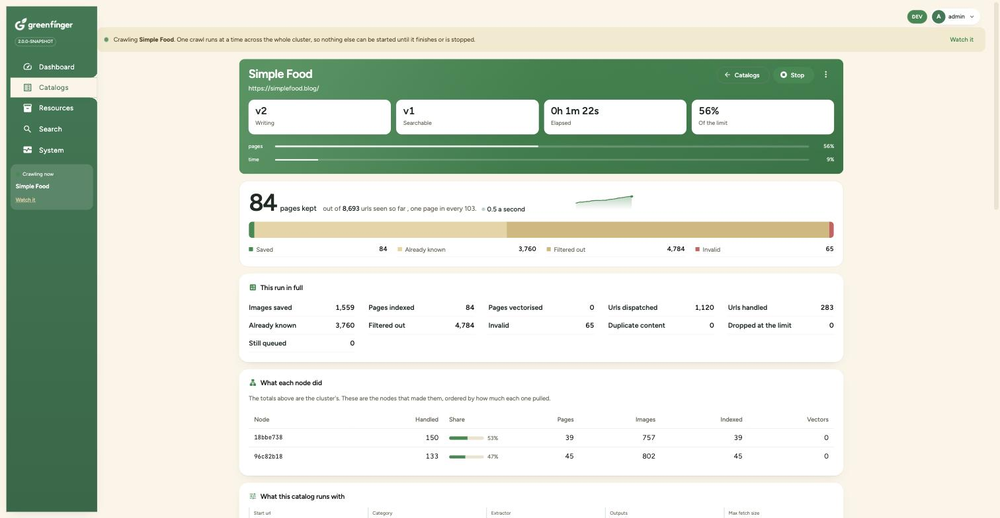
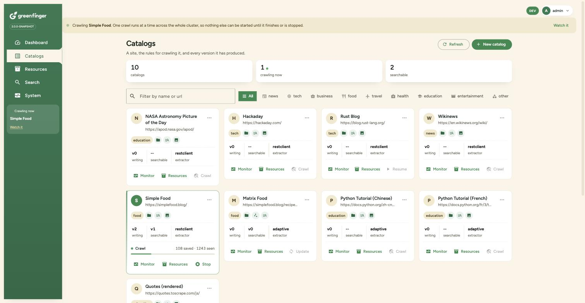
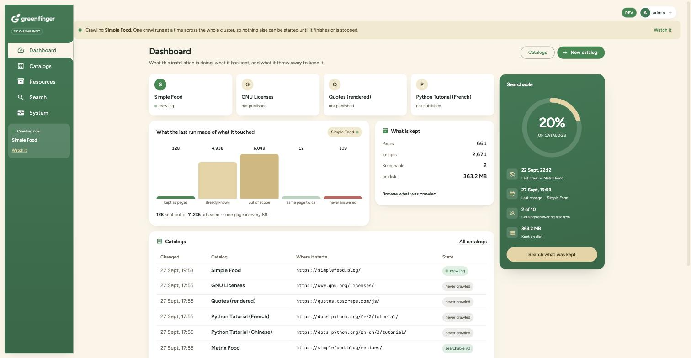
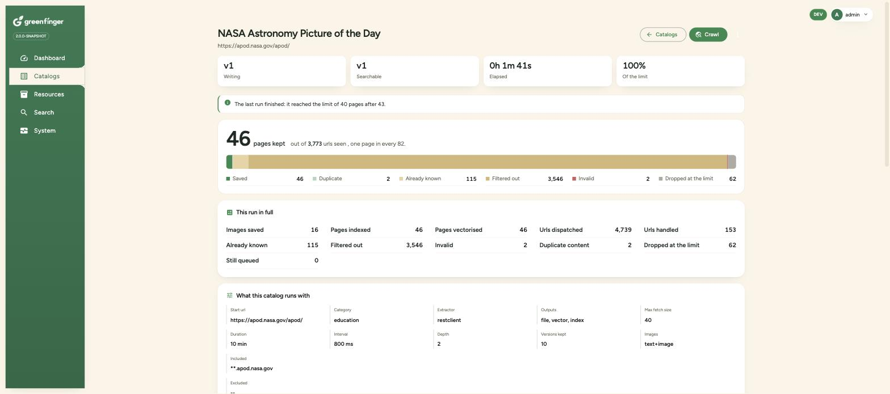
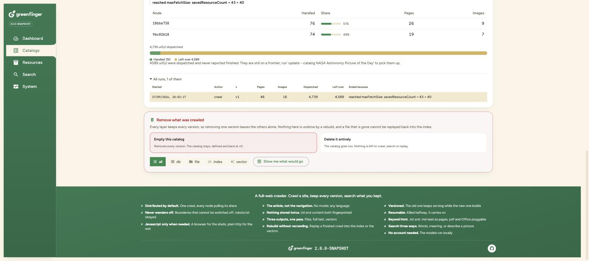
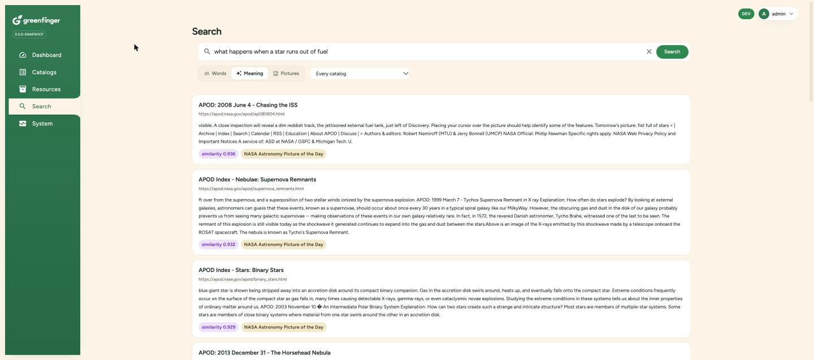

<h1 align="center">Greenfinger</h1>

<h2 align="center">One url in. A searchable archive out.</h2>

<p align="center">
<b>Crawl the whole site. Keep every page, every picture, every version.</b><br>
<b>Search it by words, by meaning, or by describing a picture you remember.</b><br>
<b>Add a node and it goes faster. Kill one and it keeps going.</b><br>
<b>Nothing to install. Nothing to sign up for.</b>
</p>

<p align="center">
<a href="LICENSE"></a>
<a href="https://spring.io/projects/spring-boot"></a>
<a href="https://openjdk.org/"></a>
<a href="https://www.elastic.co/"></a>
<a href="https://qdrant.tech/"></a>
<a href="https://min.io/"></a>
</p>

A distributed web crawler for the JVM. One pass writes plain files, a full text index and a vector
collection. Every node runs the same jar, there is no coordinator to deploy, and the first crawl
needs no database, no search server and no API key.



<p align="center"><em>A rebuild in progress. v1 keeps answering searches while v2 is being written, and each node reports what it pulled.</em></p>

## Table of contents

[Features](#features) · [Architecture](#architecture) · [Requirements](#requirements) · [Quick start](#quick-start) · [Examples](#examples) · [Configuration](#configuration) · [Performance](#performance) · [Documentation](#documentation) · [Roadmap](#roadmap) · [Contributing](#contributing) · [License](#license)

---

## Features

Each line is a problem crawlers actually hit, and what Greenfinger does about it.

| | The problem | What it does |
|---|---|---|
| **Stays on the site** | One advert link and an unbounded crawler is downloading the rest of the web | Two boundary rules that cannot be switched off: same registrable domain, and under the start url. robots.txt on top |
| **Scales sideways** | Going faster means a queue, a scheduler and a week of work | Every node runs the same jar and pulls its own share. No queue service, no scheduler, no leader in the fetch path |
| **Survives a kill** | Killed at page 40,000, the in-memory queue is gone | The frontier is on disk. A resume carries on from where it stopped |
| **Three outputs, one pass** | Files here, an index there, embeddings elsewhere, three pieces of glue | One crawl writes files, a full text index and vectors. Pick any combination per catalog |
| **Rebuilds without recrawling** | The index was lost, or the analyzer changed, and the site has to be crawled again | `replay` rebuilds the index or the vectors from the files. The site is never touched |
| **Reads past html** | The handbook is a pdf, the price list a spreadsheet, and the crawler walks past both | Document links are recorded on every crawl, for free. Switch reading on and text, markdown and csv are parsed out of the box, pdf one bean away |
| **Keeps the article** | Navigation and cookie banners get indexed, so every result looks the same | Boilerplate dropped by link density. No model and no dictionary, so any language behaves the same |
| **Stores nothing twice** | The same article under two urls, kept twice | Urls normalised into RocksDB, content fingerprinted with SHA-256 or SimHash |
| **Versions, safely** | A rebuild takes search down while it runs | A rebuild opens a new version beside the old one, and search keeps answering from the old one |
| **Searches three ways** | Keyword search cannot find a page that never says the words | Words to the index, meaning to the text vectors, pictures by describing them. Models run locally |

### What it looks like

| | |
|---|---|
|  |  |
| **Catalogs.** A site, the rules for crawling it, and every version it produced, with live progress while it runs. | **Dashboard.** What this installation kept, and what it threw away to keep it. |
|  |  |
| **Monitor.** Where every url went, live and in the report of every finished run. | **Per node.** The totals above are the cluster's. These are the nodes that made them. |
|  |  |
| **Meaning.** The query is *what happens when a star runs out of fuel*. The top answer never contains that sentence. | **Pictures.** The query is *a bright spiral galaxy against black sky*, matched against the picture itself. |

---

## Architecture

### One pass, three outputs

``` text
                            ┌──────────────┐
                            │  file        │  local disk, MinIO, any S3 store
   one crawl  ───────────►  ├──────────────┤
                            │  index       │  Lucene embedded, Elasticsearch
                            ├──────────────┤
                            │  vector      │  Lucene embedded, Qdrant, Weaviate, ES
                            └──────────────┘
                                   │
                    replay ────────┘   rebuild index or vectors from the files,
                                       without fetching the site again
```

The file layer is always on, because the database keeps metadata only and the other two rebuild
from what it wrote. **Search never reads the database**, which is the constraint the whole design
follows from.

### What one page goes through

``` text
  url from the frontier
        │
        ├─ UrlPathAcceptor chain    domain, start url prefix, assets, robots.txt,
        │                           depth, path patterns. First refusal wins
        ├─ ExistingUrlPathFilter    seen before? RocksDB
        ├─ Extractor                plain http, browser only for unrendered shells
        ├─ ContentExtractor         the article, not the navigation
        │     └─ DocumentContentParser   when it is not html
        ├─ ContentDedupFilter       SHA-256 or SimHash
        ├─ OutputChannels           file, index, vector
        └─ new links ─────────────► back to the frontier, to whichever node owns them
```

Every drop is counted and named, which is why the monitor can say where 22,000 urls went rather
than only that 140 pages were kept.

### How the cluster shares one crawl

``` text
   node A ── finds /a/b ──► node C owns it ──► fetches, finds /a/b/c ──► node A owns it ──► ...

   no central queue        no leader in the fetch path        join or leave mid crawl
```

One url dispatched is one call to whichever node owns it, routed by a consistent hash of
`catalogId|version|url`. There is no join, because a parent page does not care what its children
found.

**Completion is decided by everyone.** Every node checks the shared counters against
`maxFetchSize` and `fetchDuration`, and the first to notice writes the reason. A leader that dies
mid crawl cannot leave a crawl that never ends.

**What replicates.** Rows, blobs and vectors replicate themselves. The embedded Lucene index and
the RocksDB directories are per node, so index documents travel on their own channel and deletions
travel as an instruction. Elasticsearch and Qdrant are one shared cluster and need none of it.

### What lands on disk

``` text
deploy/data/
  system/                                  working state. Local to a node, always
    greenfinger.mv.db                      H2, when no database server was configured
    frontier/                              RocksDB: the urls still to visit
    dedup/url/  dedup/content/             RocksDB: what has been seen already
  user/                                    what was crawled. This is what a search reads
    assets/{catalogId}/v0/
      settings.json                        how this version was configured, and how it went
      reports/{stamp}-{action}-{node}.json one file per run
      pages/ab/cd/{id}.html                the page as fetched
      pages/ab/cd/{id}.txt                 the article, with the navigation removed
      images/ab/cd/{id}.jpg                the pictures it referenced
    index/{prefix}-{catalogId}/            embedded Lucene, one index per catalog
    vector/{collection}_{dimensions}/      embedded Lucene, one per embedding width
```

`system/` can be deleted without affecting a search, at the cost of a resume. `user/` is the half
worth backing up. Paths are keyed by catalog id, never name, so renaming moves nothing. MinIO
object keys are identical to these paths.

---

## Requirements

| | Version | Needed for |
|---|---|---|
| **JDK** | 17 or later | Running anything |
| **Maven** | 3.9 or later | Building from source |
| **Node** | 20 or later | Building the web interface |
| **Docker** | any current | `run-docker.sh` only |

**Nothing else is required.** H2 and an embedded Lucene index are the defaults, and the embedding
models are ONNX files downloaded once into `GF_MODEL_DIR`. Everything below is optional and opt in
one variable at a time.

| Optional service | Versions | Replaces |
|---|---|---|
| PostgreSQL, MySQL, SQL Server, Oracle, SQLite | current | The H2 metadata file |
| Elasticsearch | 7, 8 or 9 | The embedded Lucene index |
| Qdrant, Weaviate, Elasticsearch | current | The embedded Lucene vector store |
| MinIO, or any S3 compatible store | 9.x client | Local disk for pages and images |
| Ollama, OpenAI | current | The local ONNX embedding models |

A browser is needed only for the `playwright` and `selenium` extractors. The default `adaptive`
extractor falls back to HtmlUnit, which is pure Java and needs nothing installed.

---

## Quick start

### Build

``` shell
git clone https://github.com/paganini2008/greenfinger.git
cd greenfinger/backend
mvn clean install
```

That produces `deploy/`: four launchers, the jars in `lib/`, the configuration in `config/`, and
`run.conf` beside them.

### Crawl a site in one command

``` shell
cd deploy
./greenfinger-cli.sh --cluster=demo crawl --url=https://books.toscrape.com
```

Expected output:

``` text
Crawling 'books.toscrape.com' from https://books.toscrape.com

  pages kept    1,000      urls seen   28,411      1 in every 28
  images        3,204      indexed      1,000      elapsed  0h 4m 12s

Finished: reached maxFetchSize
Catalog 01a0c3d5-7d3d-7000-81f6-76057a403db8, version 0, now searchable.
```

Up to 10,000 pages, no depth limit, a second apart, images downloaded, metadata in an H2 file and
pages under `./data`. `--cluster=<name>` is required and has no default, because a cluster crawls
one catalog at a time and the name is what keeps two runs apart.

### Or bring up the nodes and the console

``` shell
./run-local.sh                # nodes plus the page on http://localhost:9700
GF_NODES=3 ./run-local.sh     # three nodes sharing one crawl
./run-docker.sh               # the same, in containers
./run-local.sh stop
```

Sign in with `admin` and the password in `deploy/config/api/users.xml`. Seven example catalogs ship
with a fresh install, so there is something to crawl before you have picked anything.

### The four launchers

| | What it is | Cluster | Port |
|---|---|---|---|
| `./greenfinger-cli.sh --cluster=<name> <verb>` | A crawler. One command, printed, done | whatever you called it | 22000 |
| `./greenfinger-shell.sh --cluster=<name>` | A prompt on a cluster somebody is running | the one you attach to | 22010 |
| `./run-local.sh` | The nodes here as background processes, plus the page | `greenfinger-local` | 22010 |
| `./run-docker.sh` | One container per node, plus the page container | `greenfinger-docker` | 22020 |

`deploy/` is a build output and is not in the repository. Every file in it is edited at its source:

| In deploy/ | Edited in |
|---|---|
| `greenfinger-cli.sh`, `greenfinger-shell.sh`, `run.conf`, `.env.example` | `backend/greenfinger-shell/src/main/resources/bin/` |
| `run-local.sh`, `run-docker.sh` | `backend/greenfinger-api/src/main/resources/bin/` |
| `config/` | `backend/greenfinger-shell/src/main/resources/config/` |
| `docker/Dockerfile` | `backend/greenfinger-api/src/main/resources/docker/` |
| `docker/Dockerfile.web`, `docker/server.js`, `docker/static/` | `frontend/greenfinger-ui/` |

Deleting `deploy/` and rebuilding is safe, with three exceptions a build cannot put back: `data/`,
`.env`, and a `run.conf` you have filled in.

---

## Examples

### Crawl, update, rebuild, replay

**Input.** A catalog id, and a verb.

``` shell
./greenfinger-cli.sh --cluster=nightly crawl   --id=<id>            # from the start url
./greenfinger-cli.sh --cluster=nightly crawl   --id=<id> --node=3   # three processes here
./greenfinger-cli.sh --cluster=nightly update  --id=<id>            # urls that appeared since
./greenfinger-cli.sh --cluster=nightly merge   --id=<id>            # and revisit what is held
./greenfinger-cli.sh --cluster=nightly rebuild --id=<id>            # new version, old one served
./greenfinger-cli.sh --cluster=nightly resume  --id=<id>            # continue after a pause
./greenfinger-cli.sh --cluster=nightly pause   --id=<id>
./greenfinger-cli.sh --cluster=nightly replay  --id=<id> --layers=index+vector
```

**Output.** Each verb exits non zero on failure and prints what it did. What each one means:

| Verb | Version | Fetches | Writes |
|---|---|---|---|
| `crawl` | current | from the start url | everything it saves |
| `update` | current | only urls not seen before | new pages only |
| `merge` | current | new urls **and** pages already held | only the pages that changed |
| `rebuild` | a new one | the whole site again | the new version, old one keeps serving |
| `resume` | current | what is left on the frontier | as the interrupted run would have |
| `replay` | a named one | nothing | rebuilds an output from what is stored |

Three ways of naming the same catalog: `--id=<id>`, `--name=<name>`, or `--url=<url>`, which
creates one if there is no catalog for that url yet.

### Drive a running cluster from a prompt

**Input.** Nodes already running, then the prompt attaches to them.

``` shell
./run-local.sh
./greenfinger-shell.sh --cluster=greenfinger-local
```

**Execution.**

``` text
greenfinger:> catalog-list
greenfinger:> search --query="what happens when a star runs out of fuel" --mode=meaning --size=3
```

**Output.**

``` text
╭──────────────────────────────────────┬───────────────────────────────────┬─────────────────────────────┬───────────┬───────────────────┬─────────┬────────╮
│ Id                                   │ Name                              │ Url                         │ Category  │ Outputs           │ Version │ Search │
├──────────────────────────────────────┼───────────────────────────────────┼─────────────────────────────┼───────────┼───────────────────┼─────────┼────────┤
│ 01a0c3ac-90bc-7000-82aa-adcb256bc8bc │ NASA Astronomy Picture of the Day │ https://apod.nasa.gov/apod/ │ education │ file+vector+index │ v1      │ v1     │
│ 01a0c3ac-9152-7000-a9aa-7749058dd231 │ Rust Blog                         │ https://blog.rust-lang.org/ │ tech      │ file+index        │ v0      │ v0     │
│ 01a0c3d5-7d3d-7000-81f6-76057a403db8 │ Simple Food                       │ https://simplefood.blog/    │ food      │ file+vector+index │ v2      │ v1     │
╰──────────────────────────────────────┴───────────────────────────────────┴─────────────────────────────┴───────────┴───────────────────┴─────────┴────────╯

╭────────┬──────────────────────────────────────────┬────────────────────────────────────────────────╮
│ Score  │ Title                                    │ Url                                            │
├────────┼──────────────────────────────────────────┼────────────────────────────────────────────────┤
│ 0.9356 │ APOD: 2008 June 4 - Chasing the ISS      │ https://apod.nasa.gov/apod/ap080604.html       │
│ 0.9317 │ APOD Index - Nebulae: Supernova Remnants │ https://apod.nasa.gov/apod/supernova_remnants… │
│ 0.9289 │ APOD Index - Stars: Binary Stars         │ https://apod.nasa.gov/apod/binary_stars.html   │
╰────────┴──────────────────────────────────────────┴────────────────────────────────────────────────╯
```

Multi word queries need double quotes, because the prompt tokenises the line before the command
sees it. Every command:

``` text
CATALOGS                              CRAWLING                          SEARCHING
catalog-list                          catalog-crawl  --id=<id>          search --query=<words>
catalog-show    --id=<id>             update         --id=<id>          search --query=<w> --mode=meaning
catalog-save                          resume         --id=<id>          search --query=<w> --mode=pictures
catalog-save    --json='{...}'        rebuild        --id=<id>          search                (lists everything)
catalog-delete  --id=<id>             pause          --id=<id>          search --query=<w> --id=<id>
catalog-cats                          status                            index-info
versions        --id=<id>             status --all=true                 vector-info
crawler-report  --id=<id>             delete         --id=<id> ...
                                      replay         --id=<id> --layers=index
                                      test-url       --url=<url>
                                      options
```

### Remove what a crawl produced

**Input.** A catalog, and which layers to touch.

``` shell
delete --id=<id> --version=3                 one version
delete --id=<id> --keep-latest=3             keep the newest three, remove the rest
delete --id=<id> --all=true                  every version, the index stays and is empty
delete --id=<id> --all=true --purge=true     every version, and drop the index too
delete --id=<id> --all=true --dry-run=true   what it would remove, and remove nothing
delete --id=<id> --version=3 --layers=vector only the vectors of that version
```

**Output.** A preview is the same walk as the delete, so what `--dry-run=true` reports is exactly
what a real one touches. On the REST endpoint `dryRun` **defaults to true**, so a caller who
forgets it gets a preview rather than a deletion.

`--layers` takes `db`, `file`, `index`, `vector` or `all`, joined with `+`. `catalog-delete`
removes the definition instead.

### Add a pdf parser

**Input.** A site that links pdfs, and a parser bean.

**Code.** Every default is `@ConditionalOnMissingBean`, so publishing a bean is the whole
registration. Pdf, Word and Excel each mean another dependency with its own licence and its own
appetite for memory, which is the application's decision rather than the crawler's.

``` java
@Bean
DocumentContentParser pdfParser() {
    return new DocumentContentParser() {
        public Set<String> fileTypes() {
            return Set.of("pdf");
        }

        public String extractText(byte[] content, String url, Charset encoding) throws Exception {
            return new Tika().parseToString(new ByteArrayInputStream(content));
        }
    };
}
```

**Output.** Pdfs linked from a crawled page now contribute text to the index and the vectors. A
format nothing reads comes back empty rather than throwing, because a site linking a pdf is not a
broken site.

Every seam works the same way:

| Interface | Decides | What ships |
|---|---|---|
| `Extractor` | How a page is fetched | restclient, htmlunit, playwright, selenium, adaptive |
| `RenderingDetector` | Whether it came back as an unrendered shell | Two length thresholds |
| `UrlPathAcceptor` | Whether a link is followed | Domain, start url, assets, robots.txt, depth, patterns |
| `ExistingUrlPathFilter` | Whether a url was seen before | rocksdb |
| `ContentDedupFilter` | Whether two urls are the same page | sha256, simhash |
| `ContentExtractor` | The text inside a page | Link density boilerplate removal |
| `DocumentContentParser` | Text out of a non html file | text, markdown, csv |
| `CompletionChecker` | When the crawl is over | Saved count, elapsed time |
| `CrawlFrontier` | The queue of what is left | rocksdb, one per catalog and version |
| `OutputChannel` | Where results are written | file, index, vector |
| `BlobStore` | Pages and images as bytes | local, minio |
| `Searcher` / `IndexAdmin` | Full text | lucene, elasticsearch |
| `VectorStore` | Meaning and pictures | lucene, elasticsearch, qdrant, weaviate |
| `EmbeddingClient` | What turns text into a vector | local ONNX, ollama, openai |
| `CatalogStore` / `ResourceRecordStore` | The metadata | JPA, json file, memory |

`WebCrawlerComponentFactory` builds all of them. Publish your own and none of the defaults are
created.

### Ship a fresh install with your own catalogs

**Input.** A json file of catalog definitions.

``` json
[
  {
    "name": "My site",
    "url": "https://example.com/docs/",
    "cat": "tech",
    "maxFetchSize": 200,
    "depth": 2,
    "fetchInterval": 1000,
    "outputTypes": ["FILE", "INDEX"]
  }
]
```

**Execution.** `GF_INITIAL_CATALOGS=/path/to/catalogs.json`, or leave it and the shipped
`classpath:initial_catalogs.json` is used. Set it empty to load none.

**Output.** Read once at startup. Every catalog in it that is not already stored is defined.
Matching is by name, so a second start defines nothing and an edit afterwards is never undone.

### Embed the api in your own application

**Input.** A Spring Boot application of your own.

``` java
@EnableGreenfingerServer
@SpringBootApplication
public class MyApplication {
    public static void main(String[] args) {
        SpringApplication.run(MyApplication.class, args);
    }
}
```

Or drive a crawl directly, without the server:

``` java
@Autowired
private CatalogAdminService catalogAdminService;
@Autowired
private CrawlerLauncher crawlerLauncher;

Catalog catalog = new Catalog();
catalog.setName("example");
catalog.setUrl("https://example.com");
catalog.setOutputTypes(Set.of(OutputType.FILE, OutputType.INDEX));
catalog = catalogAdminService.save(catalog);

CrawlerEngine.Result result = crawlerLauncher.crawl(catalog.getId(), context -> {
    // called once the components are up, before the first url is fetched
});
```

**Output.** `CrawlerEngine.Result` carries the counters and the reason the crawl ended.
`@EnableGreenfingerServer` is explicit rather than auto configured, because sitting on a classpath
is not a reason to open RocksDB and take a crawl permit.

### Call the REST api

**Input.** A bearer token from `POST /v2/login`, then any of these.

``` text
GET    /v2/catalog                       every catalog
POST   /v2/catalog                       create or update one
GET    /v2/catalog/{idOrName}            one catalog
GET    /v2/catalog/{idOrName}/summary    live counters while it crawls
DELETE /v2/catalog/{idOrName}            remove the definition

POST   /v2/crawl/{idOrName}              start a crawl
POST   /v2/crawl/{idOrName}/update       the urls that appeared since
POST   /v2/crawl/{idOrName}/rebuild      a new version
POST   /v2/crawl/{idOrName}/interrupt    stop a running crawl
POST   /v2/crawl/{idOrName}/replay       rebuild an output, layers=index+vector
DELETE /v2/crawl/{idOrName}/versions     remove versions, dryRun is true by default
GET    /v2/crawl/status                  what is running, across the cluster
GET    /v2/crawl/{idOrName}/reports      one entry per finished run

GET    /v2/search?q=...                  by words
GET    /v2/search/semantic?q=...         by meaning
GET    /v2/search/images?q=...           pictures, by describing them
GET    /v2/resource?catalogId=...        rows in crawl order
```

**Output.** Every response is the same envelope, and a `success: false` is an error rather than an
empty result.

``` json
{ "success": true, "message": "ok", "data": { } }
```

The web interface uses nothing else, so anything it can do, your code can do.

---

## Configuration

Two levels. **Per catalog** settings describe one site. **Node wide** settings in `deploy/.env`
describe the installation and provide the defaults a catalog starts from.

### Per catalog

Run `options` at the prompt for this table with the live defaults.

| Property | Default | Description |
|---|---|---|
| `url` | required | http:// or https://. The identity and the outer boundary |
| `name` | the domain | Unique text, used everywhere the catalog is referred to |
| `cat` | `other` | One of nine categories, used to filter and group |
| `start-url` | `= url` | Where fetching begins. Must sit under `url` |
| `sitemap-url` | empty | A sitemap in an unusual place. Empty discovers it from robots.txt |
| `include` | `**.<domain>/**` | Ant path pattern, comma for several |
| `exclude` | empty | Ant path pattern, comma for several |
| `encoding` | `UTF-8` | Page charset, when the server is wrong about it |
| `extractor` | `adaptive` | adaptive, restclient, htmlunit, playwright, selenium |
| `max-size` | `10000` | Saved pages before the crawl stops |
| `depth` | `-1` | Link depth from the start url. -1 for no limit |
| `duration` | `30` | Minutes before the crawl stops |
| `interval` | `1000` | Milliseconds between fetches, per node |
| `retry` | `1` | Retries per url |
| `url-dedup` | `rocksdb` | Or a filter of your own, by class name |
| `images` | `true` | Whether pictures are fetched at all |
| `output-types` | `file` | `file+index+vector`. file is always on |
| `content` | `text+image` | What reaches the index and the vectors |
| `max-versions` | `10` | How many versions to keep before pruning the oldest |

### Node wide, in `deploy/.env`

**Metadata store.** H2 file by default, nothing to install.

| Property | Default | Description |
|---|---|---|
| `GF_DB_URL` | an H2 file | jdbc url. PostgreSQL, MySQL, SQL Server, Oracle, SQLite |
| `GF_DB_USERNAME` | empty | |
| `GF_DB_PASSWORD` | empty | |
| `GF_DB_DDL` | `update` | `update` suits a laptop. Use the schema scripts for anything else |

**Full text index.**

| Property | Default | Description |
|---|---|---|
| `GF_INDEX_PROVIDER` | `lucene` | `lucene` or `elasticsearch` |
| `GF_ES_URIS` | empty | Comma separated, for elasticsearch |
| `GF_ES_ANALYZER` | `standard` | `ik_max_word` and `ik_smart` need the analysis-ik plugin |
| `GF_LUCENE_ANALYZER` | `standard` | `standard`, `smartcn` or `cjk` |
| `GF_LUCENE_COMMIT_EVERY` | `1000` | Documents between commits |
| `GF_INDEX_PREFIX` | `greenfinger` | One index per catalog, named `<prefix>-<catalogId>` |

**Vector store.**

| Property | Default | Description |
|---|---|---|
| `GF_VECTOR_STORE` | `lucene` | `lucene`, `elasticsearch`, `qdrant` or `weaviate` |
| `GF_QDRANT_URL` | empty | |
| `GF_WEAVIATE_URL` | empty | |

**Embeddings.** The default provider needs no account and no network.

| Property | Default | Description |
|---|---|---|
| `GF_EMBEDDING_PROVIDER` | `local` | `local` ONNX, `ollama` or `openai` |
| `GF_PRELOAD_TEXT_MODEL` | `true` | Load the text model at startup, on a background thread |
| `GF_PRELOAD_IMAGE_MODEL` | `true` | The same for the image model |
| `GF_MODEL_DIR` | `./models` | Where the ONNX files are cached. Downloaded once |
| `GF_EMBEDDING_OFFLINE` | `false` | Refuse to download, and fail loudly if a model is missing |
| `GF_OLLAMA_URL` | empty | |
| `GF_OLLAMA_MODEL` | empty | |
| `OPENAI_API_KEY` | empty | The only genuinely secret value here |

**Files.**

| Property | Default | Description |
|---|---|---|
| `GF_FILE_TARGET` | `local` | `local` or `minio`. Object keys match the local paths exactly |
| `GF_MINIO_ENDPOINT` | empty | AWS S3 and GCS publish S3 compatible endpoints too |
| `GF_MINIO_ACCESS_KEY` | empty | |
| `GF_MINIO_SECRET_KEY` | empty | |
| `GF_MINIO_BUCKET` | `greenfinger` | |
| `GF_DATA_STORE` | `./data` | Everything on disk lives under here |

**Crawl defaults.** Each one is the value a new catalog starts from.

| Property | Default | Description |
|---|---|---|
| `GF_OUTPUT_TYPES` | `file` | Combine with commas |
| `GF_EXTRACTOR` | `adaptive` | |
| `GF_MAX_FETCH_SIZE` | `10000` | |
| `GF_FETCH_INTERVAL` | `1000` | Milliseconds, per node |
| `GF_WORK_THREADS` | `16` | Worker threads on each node |
| `GF_MAX_CONSECUTIVE_FAILURES` | `20` | Fetches in a row that return nothing before giving up |
| `GF_MAX_VERSIONS` | `10` | |
| `GF_SKIP_EXTENSIONS` | empty | Extensions never followed as a page. Empty keeps the built in list, `none` turns the check off |
| `GF_DOCUMENTS` | `false` | Whether linked documents are **fetched and read**. Recording the links is always on |
| `GF_DOCUMENT_TYPES` | empty | Which formats to read. Naming one nothing can parse fails at startup |
| `GF_DOCUMENT_MAX_BYTES` | `10485760` | |

**Cluster.**

| Property | Default | Description |
|---|---|---|
| `GF_CLUSTER_NAME` | per launcher | Nodes agreeing on name **and** port find each other |
| `GF_CLUSTER_PORT` | per launcher | 22000 cli, 22010 local, 22020 docker |
| `GF_CLUSTER_HOSTS` | `127.0.0.1` | Where to knock, for other machines |
| `GF_CLUSTER_TRANSPORT` | `NETTY` | `NETTY` or the built in `NIO` |
| `GF_NODES` | `1` | How many processes a launcher starts |
| `GF_MEMORY` | `2g` | Per container. Caps heap **and** off heap together |

**Server and security.**

| Property | Default | Description |
|---|---|---|
| `GF_SERVER_PORT` | `50080` | The api |
| `GF_WEB_PORT` | `9700` | The page, in front of every node |
| `GF_SECURITY_ENABLED` | `true` | |
| `GF_USERS_FILE` | `config/api/users.xml` | Two roles, ADMIN and SUPPORT |
| `GF_TOKEN_SECRET` | generated | Signed, stateless tokens. Any node verifies one |
| `GF_TOKEN_VALIDITY` | `8h` | A duration, not a number of seconds |
| `GF_CORS_ORIGINS` | localhost 4200 and 9700 | Comma separated. The dev server and the page container |
| `GF_PROFILE` | `dev` | `dev` or `prod`. The only difference is the database |

Anything already in the environment wins over the file, so a one off stays a one off:

``` shell
GF_DATA_STORE=/var/gf ./greenfinger-cli.sh --cluster=nightly crawl --id=<id>
```

**What a node is actually running** is one endpoint. `/actuator/settings` merges the packaged yaml,
the copy beside the launcher, `.env` and the command line, because no single file answers it.

**Two settings worth knowing about.** The standard analyzer cuts Chinese into single characters,
and a Chinese analyzer drops French characters outright, so `GF_LUCENE_ANALYZER` matters more than
it looks. And `GF_MEMORY` caps heap plus off heap together, while the ONNX models and a browser are
both off heap, which is why 1g is not enough for either.

---

## Performance

Numbers from our own runs only. There is no comparison here against other crawlers, because we
have not run the controlled experiment that would make one honest.

**Test environment.** Apple M2 Max, 12 cores, 32 GB, macOS 26.3.1, JDK 17.0.12. Two nodes started
by `run-local.sh`, each `-Xms256m -Xmx2g`. H2 file, embedded Lucene index, embedded Lucene vector
store, pages and images on local disk, local ONNX embeddings. Home broadband. Polite crawling, so
`fetchInterval` is the floor on throughput rather than the hardware.

### Crawling

| Site | Nodes | Kept | Images | Urls seen | Elapsed |
|---|---|---|---|---|---|
| apod.nasa.gov | 2 | 46 pages | 16 | 3,773 | 1m 41s |
| simplefood.blog | 2 | 140 pages | 2,489 | 22,857 already known | 5m 01s |
| books.toscrape.com | 1 | 1,000 pages | 3,204 | 28,411 | 4m 12s |

The gap between urls seen and pages kept is the point rather than an inefficiency. On simplefood
22,340 urls were filtered out by the boundary rules and 561 were duplicate content, which is work
the outputs never had to do.

### How evenly the work spreads

``` text
two nodes, apod.nasa.gov
  node 18bbe738   76 handled   51%   26 pages   9 images
  node 96c82b18   74 handled   49%   19 pages   7 images

three nodes, a 61 page site, one shared PostgreSQL
  dispatched 61      handled 66      saved 61
  node-1: 18 fetches   node-2: 18   node-3: 25     each page exactly once
```

An earlier run of the same 61 page site showed 161 dispatched, because all three nodes found the
same link before each other's dedup replicated. That number moves with timing. `saved` was 61 both
times, because the extra dispatches were refused by the frontier before any fetch happened.

### Search

| | Measured |
|---|---|
| Word search, embedded Lucene, 151 documents | 38 matches in **16 ms** |
| Deep paging | Cursor based, cost independent of depth. Vectors page by offset, capped at 1000 |

### Cluster wire format

``` text
CrawlTask     JSON 327 bytes, encode + decode 1,394 ns
              JDK serialization 427 bytes
```

At a thousand urls per second, which no polite crawler reaches, that is 0.14% of one core. JSON was
chosen over a faster binary format because nodes are upgraded one at a time and JSON ignores fields
it does not know.

### Embeddings

| | Measured |
|---|---|
| Both ONNX models preloaded | **4.47 s**, on a background thread after the app is ready |
| Text model | `multilingual-e5-small`, 384 dimensions |
| Image model | `SigLIP 2`, 768 dimensions |
| Idle RSS with both loaded | 1.77 to 1.88 GB |

Preloading moved out of the Spring context on purpose. Inside it, every boot paid 4.47 s including
boots that never embed anything.

### Image vectors

``` text
before   one point per page that referenced the picture      43× duplication
after    one point per picture, plus a per run id set        1.00×
```

### Container memory

| `GF_MEMORY` | Vectors | Playwright |
|---|---|---|
| 1g | OOMKilled after 20s | OOMKilled as the browser starts |
| 2g | passes | passes |
| 3g | both in one JVM still OOMKilled | |

`MaxRAMPercentage` sizes the heap, but the DJL and ONNX models and the Chromium process are both
off heap and the cgroup limit caps the total. The default is 2g, and embeddings and a browser want
separate runs.

### Build and tests

| | |
|---|---|
| Backend | 133 test classes, 1,098 test methods |
| Coverage gate | JaCoCo line coverage at least 80%, in all four modules, failing the build below it |
| Front end | 27 unit tests, 21 Playwright e2e specs |

---

## Documentation

| | |
|---|---|
| [Command line reference](docs/cli-reference.md) | Every crawl verb, every prompt command, how a terminal attaches to a cluster |
| [Developer guide](docs/developer-guide.md) | Every seam, what ships behind it, and how to put your own there |
| [Design](docs/design-2.0.md) | How the system is shaped and why, with diagrams and the numbers behind the decisions |
| [Schema scripts](docs/sql/schema-scripts.md) | One per database, generated from the entities |
| [Changelog](CHANGELOG.md) | What changed in 2.0 and what an upgrade involves |
| [Backend](backend/README.md) / [front end](frontend/README.md) | For working on them |

---

## Roadmap

| Stage | Status |
|---|---|
| Standalone crawler, command line | Done |
| Three stacking outputs, images, resumable crawls | Done |
| Versions, merge, and a delete api | Done |
| Local embeddings, text and cross modal image search | Done |
| REST api, login, two roles | Done |
| Web interface | Done |
| Distributed crawling | Done |
| Document parsers for pdf, Word and Excel | Planned |

---

## Contributing

Issues and pull requests are welcome. `mvn -o clean verify` in `backend/` is what a change has to
pass. It runs the tests and fails the build below 80% line coverage, so a change that adds a branch
adds the test for it. [backend/README.md](backend/README.md) has the rest.

## License

Apache License 2.0. See [LICENSE](LICENSE).
